# Graphical User Interface Prototype - CURRENT

Authors:

Date:

Version:

\<Report here the GUI that you propose for EZElectronics in CURRENT form, as received by teachers. You are free to organize it as you prefer. A suggested presentation matches the Use cases and scenarios defined in the Requirement document. The GUI can be shown as a sequence of graphical files (jpg, png) >

# Use case 1 - UC1 - Registrazione

## Use case 1.1

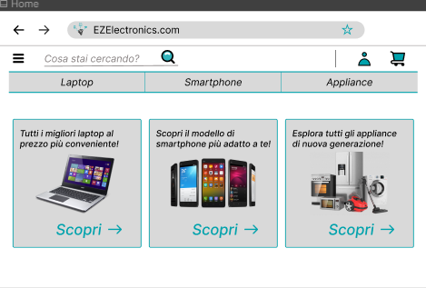
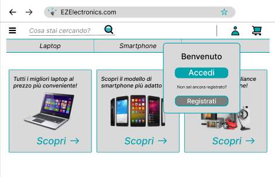

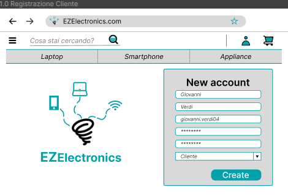
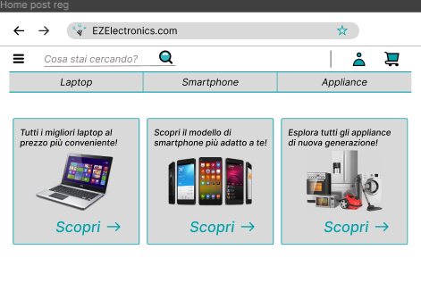

## Use case 1.2

## Use case 1.3

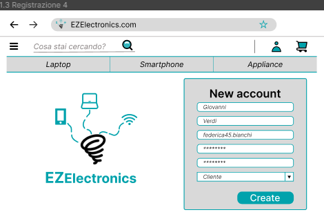
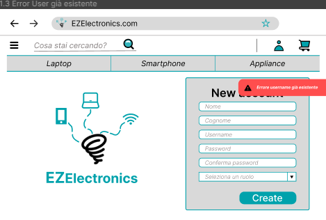

# Use case 2 - UC2 - Login

## Use case 2.1

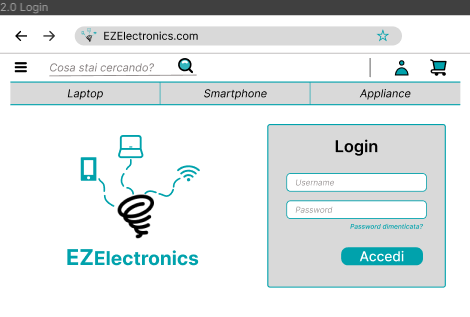
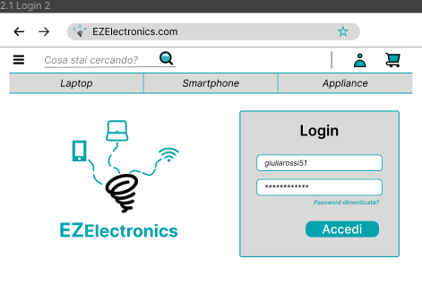

## Use case 2.2

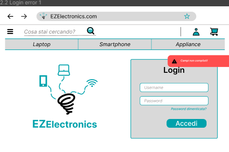

# Use case 3 - UC3 - Logout

## Use case 3.1

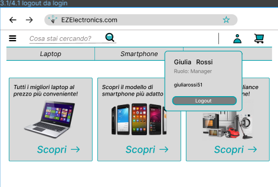

# Use case 4 - UC4 - Visualizza profilo

## Use case 4.1

# Use case 5 - UC5 - Cancellazione utente

## Use case 5.1

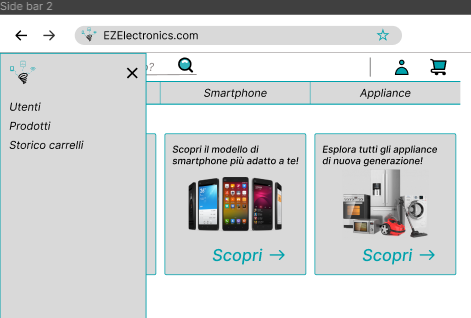
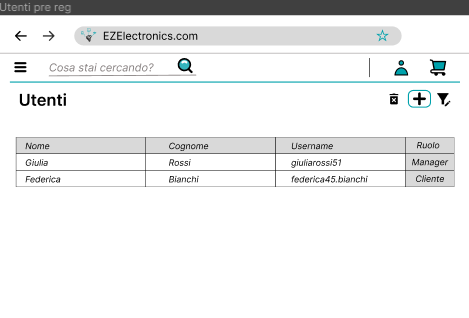
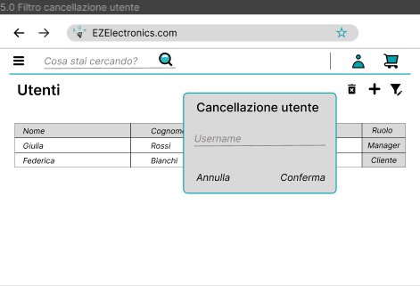
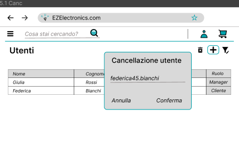

## Use case 5.2

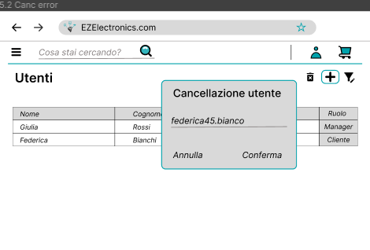
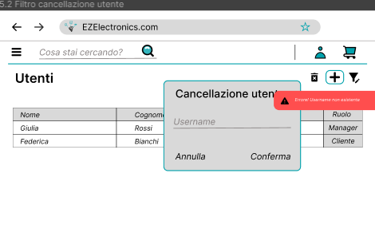

# Use case 6 - UC6 - Ricerca

## Use case 6.1

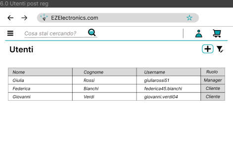
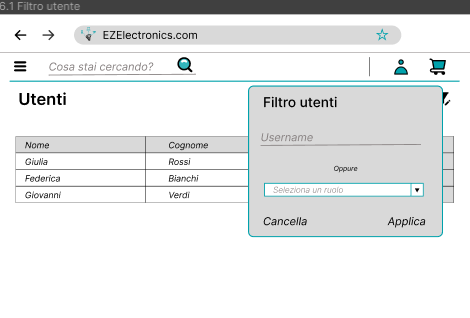

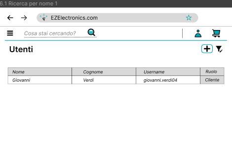
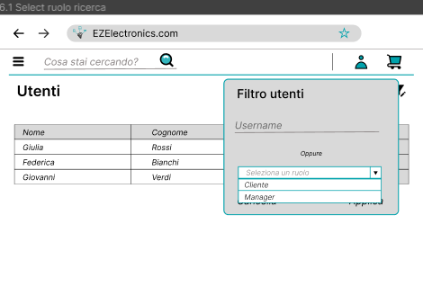
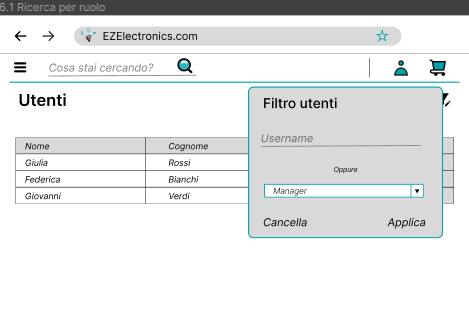
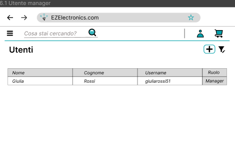

## Use case 6.2

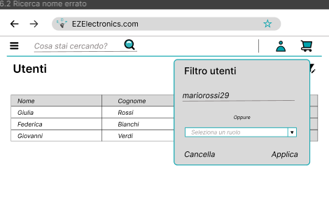
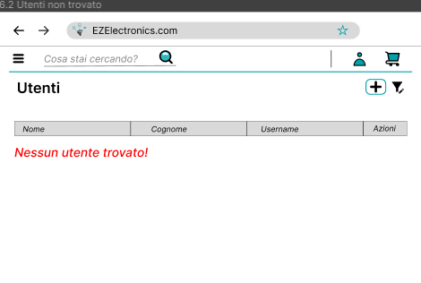

# Use case 7 - UC7 - Creazione prodotto

## Use case 7.1

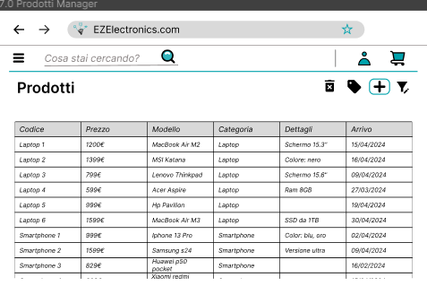

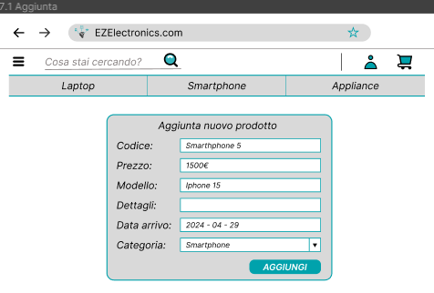

## Use case 7.2/7.3

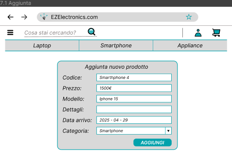
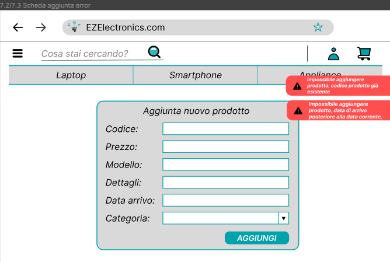

# Use case 8 - UC8 - Registrazione arrivi

## Use case 8.1

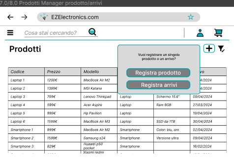
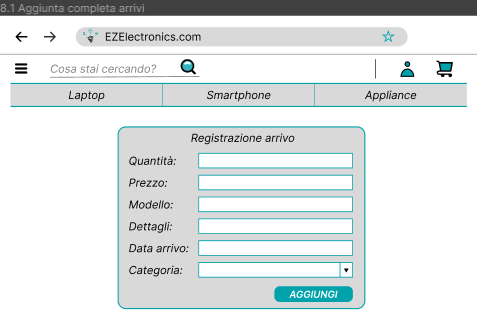
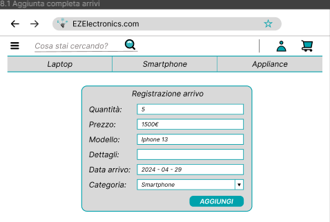
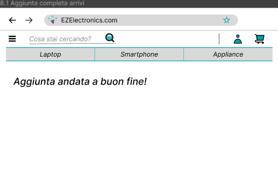

## Use case 8.2

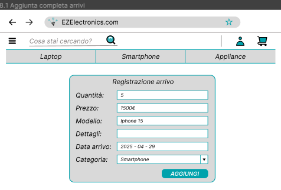
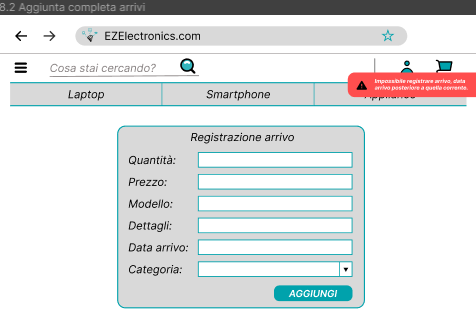

# Use case 9 - UC9 - Vendita prodotto

## Use case 9.1

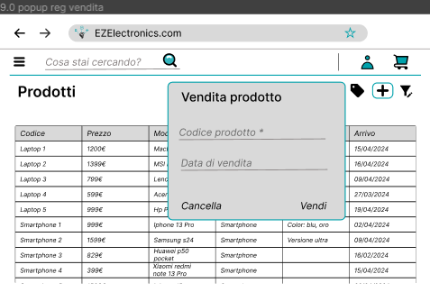
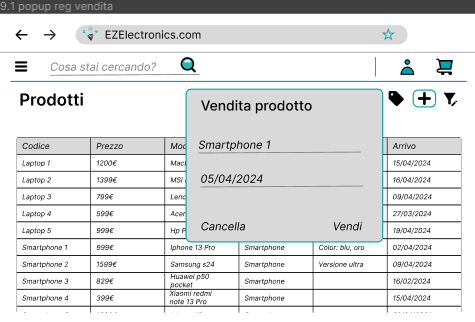
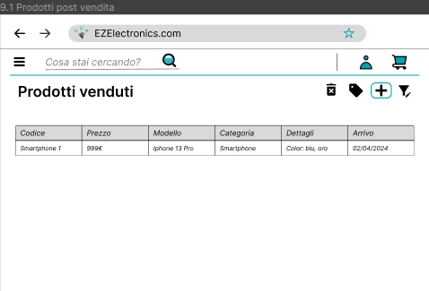

## Use case 9.2/9.3/9.4/9.5

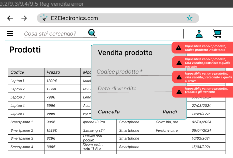

# Use case 10 - UC10 - Ricerca prodotti

## Use case 10.1

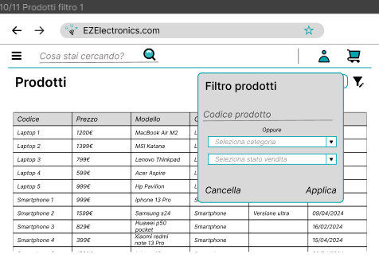
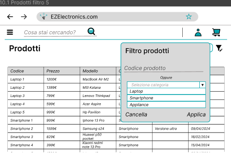
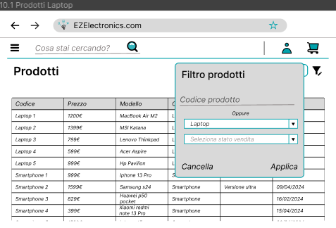
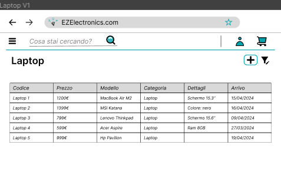

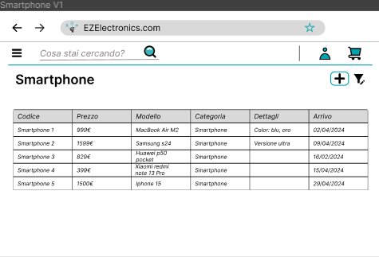
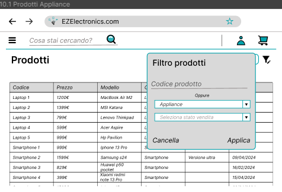
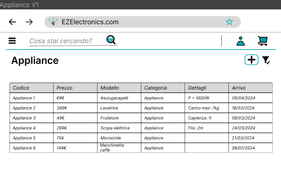
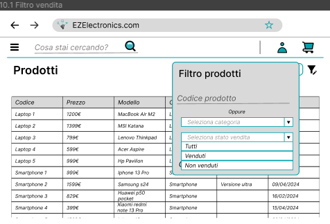
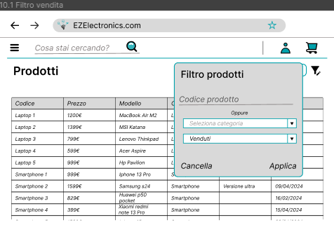

# Use case 11 - UC11 - Ricerca prodotto singolo

## Use case 11.1

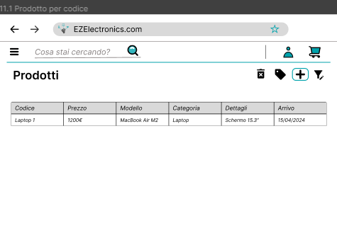

## Use case 11.2

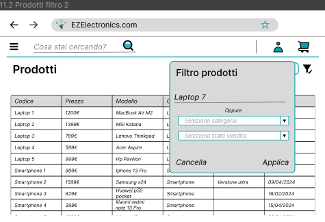
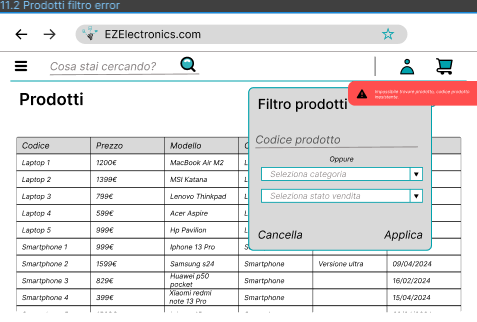

# Use case 12 - UC12 - Eliminazione prodotto singolo

## Use case 12.1

## Use case 12.2

# Use case 13 - UC13 - Visualizzazione carrello corrente

## Use case 13.1

# Use case 14 - UC14 - Aggiunta prodotto al carrello corrente

## Use case 14.1

## Use case 14.2/14.3/14.4

# Use case 15 - UC15 - Pagamento carrello corrente

## Use case 15.1

## Use case 15.2/15.3

# Use case 16 - UC16 - Visualizzazione storico carrelli

## Use case 16.1

# Use case 17 - UC17 - Eliminazione prodotto dal carrello corrente

## Use case 17.1

## Use case 17.2/17.3/17.4/17.5

# Use case 18 - UC18 - Eliminazione carrello corrente

## Use case 18.1

## Use case 18.2

