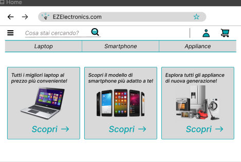
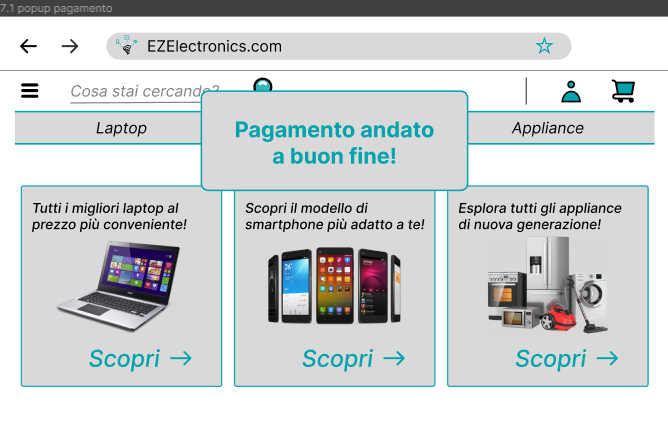
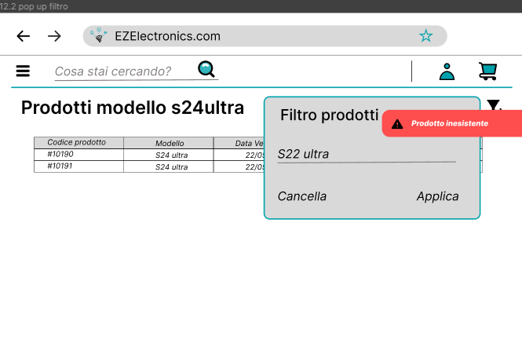
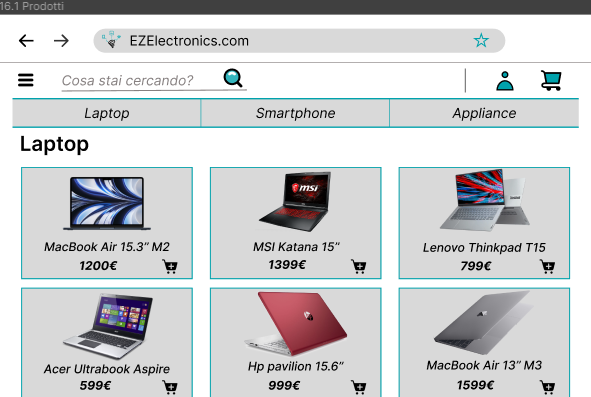

# Graphical User Interface Prototype - FUTURE

Authors:

Date:

Version:

\<Report here the GUI that you propose for EZElectronics in FUTURE form, as proposed by the team. You are free to organize it as you prefer. A suggested presentation matches the Use cases and scenarios defined in the Requirement document. The GUI can be shown as a sequence of graphical files (jpg, png) >

# Use case 1 - UC1 - Registrazione

## Use case 1.1

## Use case 1.2

## Use case 1.3

# Use case 2 - UC2 - Login

## Use case 2.1

## Use case 2.2

## Use case 2.3

# Use case 3 - UC3 - Logout

## Use case 3.1

# Use case 4 - UC4 - Visualizza profilo

## Use case 4.1

# Use case 5 - UC5 - Elimina account

## Use case 5.1

# Use case 6 - UC6 - Modifica account

## Use case 6.1

## Use case 6.2

# Use case 7 - UC7 - Upgrade account

## Use case 7.1

## Use case 7.2

# Use case 8 - UC8 - Creazione nuovo modello

## Use case 8.1

## Use case 8.2

## Use case 8.3

# Use case 9 - UC9 - Aggiunta nuovi prodotti

## Use case 9.1

# Use case 10 - UC10 - Eliminazione prodotto

## Use case 10.1

# Use case 11 - UC11 - Eliminazione modello

## Use case 11.1

# Use case 12 - UC12 - Ricerca prodotti con filtro

## Use case 12.1

## Use case 12.2

# Use case 13 - UC13 - Ricerca modelli con filtro

## Use case 13.1

## Use case 13.2

# Use case 14 - UC14 - Visualizza modello

## Use case 14.1

# Use case 15 - UC15 - Visualizza carrello corrente

## Use case 15.1

# Use case 16 - UC16 - Aggiunta prodotto al carrello corrente

## Use case 16.1

# Use case 17 - UC17 - Pagamento carrello corrente

## Use case 17.1

## Use case 17.2

# Use case 18 - UC18 - Visualizzazione storico acquisti

## Use case 18.1

# Use case 19 - UC19 - Eliminazione prodotto dal carrello corrente

## Use case 19.1

# Use case 20 - UC20 - Svuota carrello corrente

## Use case 20.1

