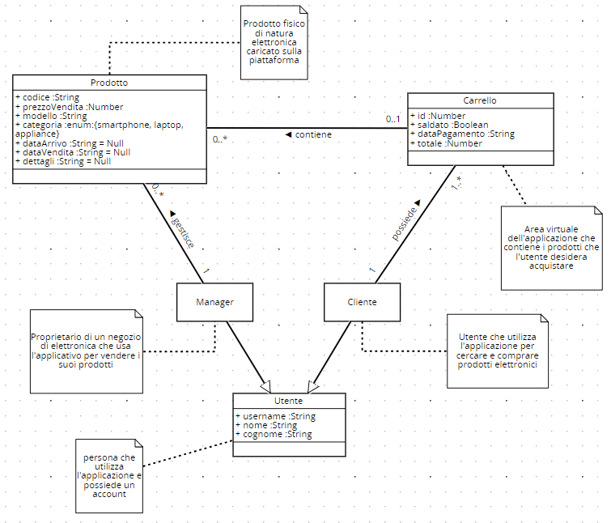

# Requirements Document - current EZElectronics

Date:

Version: V1 - description of EZElectronics in CURRENT form (as received by teachers)

| Version number | Change |
| :------------: | :----: |
|                |        |

# Contents

- [Requirements Document - current EZElectronics](#requirements-document---current-ezelectronics)
- [Contents](#contents)
- [Informal description](#informal-description)
- [Stakeholders](#stakeholders)
- [Context Diagram and interfaces](#context-diagram-and-interfaces)
  - [Context Diagram](#context-diagram)
  - [Interfaces](#interfaces)
- [Stories and personas](#stories-and-personas)
    - [Personas](#personas)
    - [Stories](#stories)
- [Functional and non functional requirements](#functional-and-non-functional-requirements)
  - [Functional Requirements](#functional-requirements)
  - [Non Functional Requirements](#non-functional-requirements)
- [Use case diagram and use cases](#use-case-diagram-and-use-cases)
  - [Use case diagram](#use-case-diagram)
    - [Use case 1, UC1, Registrazione](#use-case-1-uc1-registrazione)
    - [Use case 2, UC2, Login](#use-case-2-uc2-login)
    - [Use case 3, UC3, Logout](#use-case-3-uc3-logout)
    - [Use case 4, UC4, Visualizza profilo](#use-case-4-uc4-visualizza-profilo)
    - [Use case 5, UC5, Cancellazione utente](#use-case-5-uc5-cancellazione-utente)
    - [Use case 6, UC6, Ricerca](#use-case-6-uc6-ricerca)
    - [Use case 7, UC7, Creazione prodotto](#use-case-7-uc7-creazione-prodotto)
    - [Use case 8, UC8, Registrazione arrivi](#use-case-8-uc8-registrazione-arrivi)
    - [Use case 9, UC9, Vendita prodotto](#use-case-9-uc9-vendita-prodotto)
    - [Use case 10, UC10, Ricerca prodotti](#use-case-10-uc10-ricerca-prodotti)
    - [Use case 11, UC11, Ricerca prodotto singolo](#use-case-11-uc11-ricerca-prodotto-singolo)
    - [Use case 12, UC12, Eliminazione prodotto singolo](#use-case-12-uc12-eliminazione-prodotto-singolo)
    - [Use case 13, UC13, Visualizzazione carrello corrente](#use-case-13-uc13-visualizzazione-carrello-corrente)
    - [Use case 14, UC14, Aggiunta prodotto al carrello corrente](#use-case-14-uc14-aggiunta-prodotto-al-carrello-corrente)
    - [Use case 15, UC15, Pagamento carrello corrente](#use-case-15-uc15-pagamento-carrello-corrente)
    - [Use case 16, UC16, Visualizzazione storico carrelli](#use-case-16-uc16-visualizzazione-storico-carrelli)
    - [Use case 17, UC17, Eliminazione prodotto dal carrello corrente](#use-case-17-uc17-eliminazione-prodotto-dal-carrello-corrente)
    - [Use case 18, UC18, Eliminazione carrello corrente](#use-case-18-uc18-eliminazione-carrello-corrente)
 
- [Glossary](#glossary)
- [System Design](#system-design)
- [Deployment Diagram](#deployment-diagram)

# Informal description

EZElectronics (read EaSy Electronics) is a software application designed to help managers of electronics stores to manage their products and offer them to customers through a dedicated website. Managers can assess the available products, record new ones, and confirm purchases. Customers can see available products, add them to a cart and see the history of their past purchases.

# Stakeholders

| Stakeholder name | Description |
| :--------------: | :---------: |
| Cliente  |     L'utente che interagisce con il sistema per visualizzare o acquistare i prodotti        |
| Manager  |     L'utente che interagisce con il sistema per gestire l'inventario e le vendite      |
| Software House  |     Azienda che si occupa di sviluppare l'applicativo, di risolvere i bug in produzione        |

# Context Diagram and interfaces

## Context Diagram

## Interfaces

|   Actor   | Logical Interface | Physical Interface |
| :-------: | :---------------: | :----------------: |
| Cliente | GUI( Visualizzare prodotti, aggiungere al carrello ) |    Smartphone/PC/Tablet            |
| Manager |         GUI (Gestione prodotti)          |           PC         |

# Stories and personas

### Personas

**Persona 1:** Giovanni (cliente) è uno studente di 19 anni, appassionato di elettronica, che sta per iscriversi all'università

**Persona 2:** Federica, ha 2 figli, ha 45 anni, una cliente abituale degli store elettronici.

**Persona 3:** Giulia, una signora di 51 anni, manager che si occupa della vendita al dettaglio nel suo negozio

### Stories

**Persona 1 Story:** Giovanni vuole comprare un nuovo computer più performante per intraprendere al meglio il nuovo percorso. 

**Persona 2 Story:** Federica, sta cercando dei despositivi elettronici per semplificare la gestione della casa, essendo molto impegnata tra lavoro e famiglia preferisce ordinare online.

**Persona 3 Story:** Giulia ha uno store fisico e vorrebbe digitalizzarsi per stare al passo con i tempi. Vorrebbe raggiungere un maggior numero di clienti per rendere più profittevole il proprio Business.

# Functional and non functional requirements

## Functional Requirements

\<In the form DO SOMETHING, or VERB NOUN, describe high level capabilities of the system>

\<they match to high level use cases>

|  ID   | Description |
| :---: | :---------: |
| FR1  |  Gestione accesso          |
| FR1.1  |  Login        |
| FR1.2  |  Logout      |
| FR1.3  |  Visualizza dati profilo      |
|||
|  FR2  |  Gestione utente           |
| FR2.1  |  Registrazione      |
| FR2.2  |  Cancellazione      |
| FR2.3  |  Ricerca      |
|| |
|  FR3  |  Gestione prodotti            |
| FR3.1  |  Crea nuovo prodotto    |
| FR3.2  |  Vendita prodotto        |
| FR3.3  |  Ricerca prodotto con filtri        |
| FR3.4  |  Elimina prodotto        |
|||
|  FR4  |  Gestione carello           |
| FR4.1 |   Aggiunta prodotto al carrello     |
| FR4.2 |   Pagamento carrello    |
| FR4.3 |   Visualizzazione storico carrelli    |
| FR4.4 |   Visualizzazione carrello corrente   |
| FR4.5 |   Rimozione prodotto dal carrello    |
| FR4.6 |   Cancellazione carello    |
|||

## Acces Rights
|   Funzione    | Utente | Cliente | Manager |
| :-----: | :--------------------------------: | :---------: | :-------: |
|  Login   | x | x | x |
|  Logout   |  | x | x |
|  Visualizza dati profilo  |  | x | x |
|  Registrazione  | x | x(errore) | x(errore) |
|  Eliminazione utente  | x | x | x |
|  Ricerca  | x | x | x |
|  Crea nuovo prodotto  |  |  | x |
|  Vendita prodotto  |  |  | x |
|  Ricerca prodotto con filtri  |  | x | x |
|  Elimina prodotto  |  |  | x |
|  Aggiunta prodotto al carrello  |  | x |  |
|  Pagamento carrello  |  | x |  |
|  Visualizzazione storico carrelli  |  | x |  |
|  Visualizzazione carrello corrente  |  | x |  |
|  Rimozione prodotto dal carrello  |  | x |  |
|   Cancellazione carello  |  | x |  |

## Non Functional Requirements

\<Describe constraints on functional requirements>

|   ID    | Type (efficiency, reliability, ..) | Description | Refers to |
| :-----: | :--------------------------------: | :---------: | :-------: |
|  NFR1   |               Usability                     |    Utenti non devono necessitare di training          |     Clienti/Manager      |
|  NFR2   |         Efficiency                |        Il sito deve caricarsi in meno di 0.5s      |     Sito web      |
|  NFR3   |     Efficiency               |      Tutte le funzionalità dell’app devono completarsi in un tempo inferiore a 0.3s (escludendo la rete)         |       Sito web      |
|  NFR4   |     Affidability               |      Uptime > 98%        |       Server      |
|  NFR5  |     Portability               |       L’applicazione web deve essere disponibile per i browser    |       Server      |
|  NFR6  |     Security               |      La password deve essere salvata dopo essere stata crittografata (Hash)   |       Server      |
 

# Use case diagram and use cases

## Use case diagram

\<define here UML Use case diagram UCD summarizing all use cases, and their relationships>

\<next describe here each use case in the UCD>

### Use case 1, UC1, Registrazione

| Actors Involved  |   Utente                                                                 |
| :--------------: | :------------------------------------------------------------------: |
|   Precondition   | - |
|  Post condition  |  Utente registrato   |
| Nominal Scenario |       L'utente appena arrivato sulla piattaforma vuole crearsi un account         |
|     Variants     |                     -                   |
|    Exceptions    |                     Scenario 1.2, 1.3      |

##### Scenario 1.1

|  Scenario 1.1  |               Registrazione                                                             |
| :------------: | :------------------------------------------------------------------------: |
|   Precondition   | - |
|  Post condition  |  Utente registrato   |
|     Step#      |                                Description                                 |
|       1        |     Utente visita la piattaforma                                                                      |
|       2        |     La piattaforma richiede i dati personali e password                                                                       |
|      3       |        Inserisce i dati personali e password                                                                                           |

|  Scenario 1.2  |           Campi non compilati                                                            |
| :------------: | :------------------------------------------------------------------------: |
|   Precondition   | - |
|  Post condition  |  Registrazione fallita |
|     Step#      |                                Description                                 |
|       1        |      Visita la piattaforma                                                                      |
|       2        |     La piattaforma richiede i dati personali, password e ruolo                                                                       |
|      3       |        Utente non compila tutti i campi richiesti                                                                                           |
|      4       |       La piattaforma presenta un messaggio di errore                                                                               |

|  Scenario 1.3  |          Utente già registrato                  |
| :------------: | :------------------------------------------------------------------------: |
|   Precondition   | Utente possiede un account |
|  Post condition  |  Registrazione fallita |
|     Step#      |                                Description                                 |
|       1        |      Visita la piattaforma                                                                      |
|       2        |     La piattaforma richiede i dati personali e password                                                                       |
|      3       |        Utente inserisce i dati personali e password, ma lo username è già associato ad un altro account                                                                                            |
|      4       |       Sistema presenta un messaggio di errore                     

### Use case 2, UC2, Login

| Actors Involved  |   Utente                                                                  |
| :--------------: | :------------------------------------------------------------------: |
|   Precondition   | -  |
|  Post condition  |  Utente autenticato all'accesso   |
| Nominal Scenario |       L'utente visita la piattaforma per accedere ai servizi         |
|     Variants     |                     -                   |
|    Exceptions    |                     Scenario 2.2              |

|  Scenario 2.1  |   Login                                                                         |
| :------------: | :------------------------------------------------------------------------: |
|   Precondition   | - |
|  Post condition  |  Utente autenticato all'accesso   |
|     Step#      |                                Description                                 |
|       1        |      Visita la piattaforma                                                                      |
|       2        |     La piattaforma richiede username e password                                                                      |
|      3       |        Inserisce username e password                                                                                           |
|      4       |        Username e password sono corretti, l'utente è loggato                                                                                           |
|||

|  Scenario 2.2 |  Campi username o password non compilati                                                                        |
| :------------: | :------------------------------------------------------------------------: |
|   Precondition   | - |
|  Post condition  |  Utente non loggato   |
|     Step#      |                                Description                                 |
|       1        |      Visita la piattaforma                                                                      |
|       2        |     La piattaforma richiede username e password                                                                      |
|      3       |        L'utente non inserisce username e/o password                                 |
|      4       |       Sistema presenta un messaggio di errore    |

### Use case 3, UC3, Logout

| Actors Involved  |   Cliente, Manager                                                                   |
| :--------------: | :------------------------------------------------------------------: |
|   Precondition   | Utente autenticato |
|  Post condition  |  Utente non autenticato  |
| Nominal Scenario |       L'utente vuole uscire dalla piattaforma         |
|     Variants     |                     -                   |
|    Exceptions    |                     -               |

|  Scenario 3.1  |                                                                            |
| :------------: | :------------------------------------------------------------------------: |
|   Precondition   | Utente autenticato |
|  Post condition  |  Utente non autenticato  |
|     Step#      |                                Description                                 |
|       1        |      L'utente seleziona l'opzione di logout                                                                    |
|       2        |     Piattaforma disabilita autenticazione utente                                                                      |

### Use case 4, UC4, Visualizza profilo

| Actors Involved  |   Cliente, Manager                                                                   |
| :--------------: | :------------------------------------------------------------------: |
|   Precondition   | Utente loggato |
|  Post condition  |  Informazioni profilo visualizzate  |
| Nominal Scenario |       L'utente vuole visualizzare i propri dati       |
|     Variants     |                     -                   |
|    Exceptions    |                     -               |

|  Scenario 4.1  |                                                                            |
| :------------: | :------------------------------------------------------------------------: |
|   Precondition   | Utente loggato |
|  Post condition  |  Informazioni profilo visualizzate  |
|     Step#      |                                Description                                 |
|       1        |      La piattaforma presenta username, name, surname e ruolo dell'utente loggato                                                              |

### Use case 5, UC5, Cancellazione utente 

| Actors Involved  |   Utente                                                            |
| :--------------: | :------------------------------------------------------------------: |
|   Precondition   | - |
|  Post condition  |  Utente non esistente  |
| Nominal Scenario |       L'utente vuole cancellare un utente        |
|     Variants     |                    -                 |
|    Exceptions    |                     Scenario 5.2              |

|  Scenario 5.1  |    Cancellazione utente                                                                        |
| :------------: | :------------------------------------------------------------------------: |
|   Precondition   | - |
|  Post condition  |  Utente non esistente  |
|     Step#      |                                Description                                 |
|       1        |      L'utente vuole cancellare un utente, inserisce il relativo username e preme il pulsante "Conferma"                                                                |
|       2        |     La piattaforma elimina definitivamente l'account dell'utente                                                                      |

|  Scenario 5.2  |    Username non esistente                                                           |
| :------------: | :------------------------------------------------------------------------: |
|   Precondition   | - |
|  Post condition  |  Utente non eliminato  |
|     Step#      |                                Description                                 |
|       1        |      L'utente vuole cancellare un utente, inserisce il relativo username e preme il pulsante "Cancella utente"                                                                |
|       2        |     L'utente non esiste, la piattaforma mostra un messaggio di errore                                                             |

### Use case 6, UC6, Ricerca 

| Actors Involved  |   Utente                                                              |
| :--------------: | :------------------------------------------------------------------: |
|   Precondition   | - |
|  Post condition  |  Utenti visualizzati  |
| Nominal Scenario |       L'utente vuole visualizzare la lista di utenti filtrata e i relativi dati         |
|     Variants     |                     Tutti, per ruolo, per username               |
|    Exceptions    |           Scenario 6.2            |

|  Scenario 6.1  |     Ricerca utenti (con filtri)                                               |
| :------------: | :------------------------------------------------------------------------: |
|   Precondition   | - |
|  Post condition  |  Utenti visualizzati  |
|     Step#      |                                Description                                 |
|       1        |      L'utente vuole ricercare degli utenti                                                                  |
|       2        |     La piattaforma chiede quale filtro usare per la ricerca (senza filtro, username, ruolo)                                                                      |
|       3        |     L'utente seleziona il filtro desiderato (se non lo seleziona ricerca tutti gli utenti)                                                     |
|       4        |     La piattaforma applica il filtro alla ricerca e visualizza gli utenti                                                   |

|  Scenario 6.2 |      Utente non esistente                                                                      |
| :------------: | :------------------------------------------------------------------------: |
|   Precondition   | - |
|  Post condition  | Utente non trovato  |
|     Step#      |                                Description                                 |
|       1        |      L'utente vuole ricercare un utente per username                                                                   |
|       2        |     La piattaforma chiede l'username da cercare                                                                      |
|       3        |     L'utente inserisce un username non presente nel database                               |
|       4        |     Utente non trovato, la piattaforma presenta un messaggio di errore                                                 |

### Use case 7, UC7, Creazione prodotto

| Actors Involved  |  Manager                                                         |
| :--------------: | :------------------------------------------------------------------: |
|   Precondition   | Manager loggato |
|  Post condition  | Prodotto creato e aggiunto al db  |
| Nominal Scenario |       Il Manager vuole creare un nuovo prodotto       |
|     Variants     |                   -
|    Exceptions    |                     Scenario 7.2, 7.3 |

|  Scenario 7.1  |          Creazione prodotto                                                                  |
| :------------: | :------------------------------------------------------------------------: |
|   Precondition   | Manager loggato |
|  Post condition  | Prodotto creato e aggiunto al db  |
|     Step#      |                                Description                                 |
|       1        |      Il Manager vuole aggiungere un prodotto             |
|       2        |     La piattaforma chiede codice, modello, categoria, dettagli, data di arrivo, prezzo di vendita                             |
|       3        |     Il Manager inserisce i dati richiesti                                                     |
|       4        |   La piattaforma crea il prodotto   | 

|  Scenario 7.2  |           Prodotto già esistente                                                                 |
| :------------: | :------------------------------------------------------------------------: |
|   Precondition   | Manager loggato |
|  Post condition  | Prodotto già esistente, prodotto non creato  |
|     Step#      |                                Description                                 |
|       1        |      Il Manager vuole aggiungere un prodotto            |
|       2        |     La piattaforma chiede modello, categoria, dettagli, data di arrivo, prezzo di vendita                             |
|       3        |     Il Manager inserisce un codice prodotto già esistente nel database               |
|       4        |   La piattaforma non crea il prodotto, presenta un messaggio di errore | 

|  Scenario 7.3  |           Data di arrivo posteriore a quella corrente                                          |
| :------------: | :------------------------------------------------------------------------: |
|   Precondition   | Manager loggato |
|  Post condition  | Prodotto non creato  |
|     Step#      |                                Description                                 |
|       1        |      Il Manager vuole aggiungere un prodotto            |
|       2        |     La piattaforma chiede modello, categoria, dettagli, data di arrivo, prezzo di vendita                             |
|       3        |     Il Manager inserisce una data di arrivo posteriore a quella corrente |
|       4        |   La piattaforma non crea il prodotto, presenta un messaggio di errore | 

### Use case 8, UC8, Registrazione arrivi

| Actors Involved  |  Manager                                                         |
| :--------------: | :------------------------------------------------------------------: |
|   Precondition   | Manager loggato |
|  Post condition  | Arrivi creati e aggiunti al db  |
| Nominal Scenario |       Il Manager vuole registrare dei nuovi arrivi (prodotti dello stesso modello)       |
|     Variants     |                -
|    Exceptions    |                     Scenario 7.2 |

|  Scenario 8.1  |       Registrazione arrivi                                                                     |
| :------------: | :------------------------------------------------------------------------: |
|   Precondition   | Manager loggato |
|  Post condition  | Arrivi creati e aggiunti al db  |
|     Step#      |                                Description                                 |
|       1        |      Il Manager vuole aggiungere degli arrivi       |
|       2        |     La piattaforma chiede modello, categoria, dettagli, quantità, data di arrivo, prezzo di vendita                             |
|       3        |     Il Manager inserisce i dati richiesti                                                     |
|       4        |   La piattaforma aggiorna i dati e mostra un messaggio di conferma   | 

|  Scenario 8.2  |           Data di arrivo posteriore a quella corrente                                          |
| :------------: | :------------------------------------------------------------------------: |
|   Precondition   | Manager loggato |
|  Post condition  | Arrivi non creati |
|     Step#      |                                Description                                 |
|       1        |      Il Manager vuole aggiungere i nuovi arrivi         |
|       2        |     La piattaforma chiede modello, categoria, dettagli,quantità,  data di arrivo, prezzo di vendita                             |
|       3        |     Il Manager inserisce una data di arrivo posteriore a quella corrente |
|       4        |   La piattaforma non crea i prodotti, presenta un messaggio di errore | 

### Use case 9, UC9, Vendita prodotto

| Actors Involved  |  Manager                                                         |
| :--------------: | :------------------------------------------------------------------: |
|   Precondition   | Manager loggato |
|  Post condition  | Prodotti segnato come venduto |
| Nominal Scenario |       Il Manager vuole registrare una vendita di un prodotto       |
|     Variants     |                    -               |
|    Exceptions    |                   Scenario 9.2, 9.3, 9.4, 9.5       |

|  Scenario 9.1  |         Vendita prodotto                                                                   |
| :------------: | :------------------------------------------------------------------------: |
|   Precondition   | Manager loggato |
|  Post condition  | Prodotti segnato come venduto |
|     Step#      |                                Description                                 |
|       1        |      Il Manager vuole segnare un prodotto come venduto                                                                    |
|       2        |     La piattaforma chiede codice prodotto e opzionalmente data vendita                          |
|       3        |     Il Manager inserisce i dati richiesti                                                     |
|       4        |   La piattaforma aggiorna i dati   |   

|  Scenario 9.2  |          Codice prodotto inesistente
| :------------: | :------------------------------------------------------------------------: |
|   Precondition   | Manager loggato |
|  Post condition  | Prodotto non segnato come venduto  |
|     Step#      |                                Description                                 |
|       1        |      Il Manager vuole segnare un prodotto come venduto            |
|       2        |     La piattaforma chiede codice e data di vendita (opzionale)            |
|       3        |     Il Manager inserisce un codice prodotto non presente nel database |
|       4        |   La piattaforma non segna il prodotto come venduto, presenta un messaggio di errore | 

|  Scenario 9.3  |           Data di vendita posteriore a quella corrente                                          |
| :------------: | :------------------------------------------------------------------------: |
|   Precondition   | Manager loggato |
|  Post condition  | Prodotto non segnato come venduto  |
|     Step#      |                                Description                                 |
|       1        |      Il Manager vuole segnare un prodotto come venduto          |
|       2        |     La piattaforma chiede codice e data di vendita (opzionale)                            |
|       3        |     Il Manager inserisce una data di vendita posteriore a quella corrente |
|       4        |      La piattaforma non segna il prodotto come venduto, presenta un messaggio di errore | 

|  Scenario 9.4  |           Data di vendita precedente a quella di arrivo                                          |
| :------------: | :------------------------------------------------------------------------: |
|   Precondition   | Manager loggato |
|  Post condition  | Prodotto non segnato come venduto  |
|     Step#      |                                Description                                 |
|       1        |      Il Manager vuole segnare un prodotto come venduto          |
|       2        |     La piattaforma chiede codice e data di vendita (opzionale)                            |
|       3        |     Il Manager inserisce una data di vendita precedente a quella di arrivo |
|       4        |      La piattaforma fa un controllo sulla data di arrivo, non segna il prodotto come venduto, presenta un messaggio di errore | 

|  Scenario 9.5 |          Prodotto già venduto                                         |
| :------------: | :------------------------------------------------------------------------: |
|   Precondition   | Manager loggato |
|  Post condition  | Prodotto non segnato come venduto  |
|     Step#      |                                Description                                 |
|       1        |      Il Manager vuole segnare un prodotto come venduto          |
|       2        |     La piattaforma chiede codice e data di vendita (opzionale)                            |
|       3        |     Il Manager inserisce un codice di un prodotto già venduto |
|       4        |      La piattaforma controlla se il prodotto è già stato venduto, non segna il prodotto come venduto, presenta un messaggio di errore | 

### Use case 10, UC10, Ricerca prodotti

| Actors Involved  |  Manager, Cliente                                                         |
| :--------------: | :------------------------------------------------------------------: |
|   Precondition   |Utente loggato |
|  Post condition  | Prodotti visualizati|
| Nominal Scenario |       Un utente vuole visualizzare la lista dei prodotti      |
|     Variants     |                    Tutti (tutti, solo venduti, solo non venduti)   , per categoria (tutti, solo venduti, solo non venduti)   , per modello (tutti, solo venduti, solo non venduti)              |
|    Exceptions    |                   -        |

|  Scenario 10.1  |  Ricerca prodotti (con filtri)                                                                          |
| :------------: | :------------------------------------------------------------------------: |
|   Precondition   |Utente loggato|
|  Post condition  | Prodotti visualizati|
|     Step#      |                                Description                                 |
|       1        |      Un utente vuole visualizzare la lista dei prodotti                                                                    |
|       2        |     La piattaforma chiede il primo filtro (tutti, per modello, per categoria)                          |
|       3        |     L'utente inserisce i dati richiesti                                                     |
|       4        |  La piattaforma chiede il secondo filtro (tutti, solo venduti, solo non venduti)     |  
|       5        |    L'utente inserisce i dati richiesti    | 
| 6 | La piattaforma restituisce la lista prodotti filtrata |  

### Use case 11, UC11, Ricerca prodotto singolo

| Actors Involved  |  Manager, Cliente                                                         |
| :--------------: | :------------------------------------------------------------------: |
|   Precondition   |Utente loggato |
|  Post condition  | Prodotto visualizato|
| Nominal Scenario |       Un utente vuole visualizzare un prodotto |
|     Variants     |                    -            |
|    Exceptions    |         Scenario 11.2       |

|  Scenario 11.1  |                Ricerca prodotto singolo                                                            |
| :------------: | :------------------------------------------------------------------------: |
|   Precondition   | Utente loggato |
|  Post condition  | Prodotto visualizato|
|     Step#      |                                Description                                 |
|       1        |      Un utente vuole visualizzare un prodotto                                                         |
|       2        |     La piattaforma chiede il codice prodotto                      |
|       3        |     L'utente inserisce i dati richiesti                                                     |
| 4 | La piattaforma restituisce il prodotto desiderato|  

|  Scenario 11.2  |     Codice prodotto inesistente                                                                     |
| :------------: | :------------------------------------------------------------------------: |
|   Precondition   | Utente loggato|
|  Post condition  | Prodotto non visualizato|
|     Step#      |                                Description                                 |
|       1        |      Un utente vuole visualizzare un prodotto                                                         |
|       2        |     La piattaforma chiede il codice prodotto                      |
|       3        |     L'utente inserisce un codice non presente nel database                   |
| 4 | Prodotto non visualizzato, la piattaforma presenta un messaggio di errore|  

### Use case 12, UC12, Eliminazione prodotto singolo 

| Actors Involved  |  Manager                                                   |
| :--------------: | :------------------------------------------------------------------: |
|   Precondition   | Manager loggato |
|  Post condition  | Prodotto non esistente |
| Nominal Scenario |       Un manager vuole eliminare un prodotto |
|     Variants     |                    -            |
|    Exceptions    |         Scenario 12.2      |

|  Scenario 12.1  |        Eliminazione prodotto singolo                                                                    |
| :------------: | :------------------------------------------------------------------------: |
|   Precondition   | Manager loggato|
|  Post condition  | Prodotto eliminato|
|     Step#      |                                Description                                 |
|       1        |      Un manager vuole eliminare un prodotto                                                     |
|       2        |     La piattaforma chiede il codice prodotto                      |
|       3        |     Il manager inserisce i dati richiesti                                                     |
| 4 | La piattaforma elimina il prodotto | 

|  Scenario 12.2  |     Codice prodotto inesistente                                                                     |
| :------------: | :------------------------------------------------------------------------: |
|   Precondition   | Manager loggato|
|  Post condition  | Prodotto non eliminato|
|     Step#      |                                Description                                 |
|       1        |      Un manager vuole eliminare un prodotto                                                         |
|       2        |     La piattaforma chiede il codice prodotto                      |
|       3        |     Il manager inserisce un codice non presente nel database                   |
| 4 | La piattaforma presenta un messaggio di errore| 

### Use case 13, UC13, Visualizzazione carrello corrente

| Actors Involved  |  Cliente                                                 |
| :--------------: | :------------------------------------------------------------------: |
|   Precondition   | Cliente loggato|
|  Post condition  | Carrello corrente visualizzato |
| Nominal Scenario |       Il cliente vuole visualizzare il proprio carrello corrente |
|     Variants     |                    -            |
|    Exceptions    |         -     |

|  Scenario 13.1  |     Visualizzazione carrello corrente                                                                       |
| :------------: | :------------------------------------------------------------------------: |
|   Precondition   | Cliente loggato|
|  Post condition  | Carrello corrente visualizzato |
|     Step#      |                                Description                                 |
|       1        |      Il cliente vuole visualizzare il proprio carrello corrente                                                    |
|       2        |      La piattaforma visualizza il carrello corrente dell'utente                    |

### Use case 14, UC14, Aggiunta prodotto al carrello corrente

| Actors Involved  |  Cliente                                                 |
| :--------------: | :------------------------------------------------------------------: |
|   Precondition   | Cliente loggato |
|  Post condition  | Prodotto presente nel carrello corrente |
| Nominal Scenario |       Il cliente vuole aggiungere un prodotto al carrello corrente |
|     Variants     |                    -            |
|    Exceptions    |         Scenario 14.2, 14.3, 14.4   |

|  Scenario 14.1  |    Aggiunta prodotto al carrello corrente                                                                        |
| :------------: | :------------------------------------------------------------------------: |
|   Precondition   | Cliente loggato|
|  Post condition  | Prodotto presente nel carrello corrente |
|     Step#      |                                Description                                 |
|       1        |      Il cliente vuole aggiungere un prodotto al proprio carrello |        
|       2        |      La piattaforma richiede il codice del prodotto da aggiungere                                                 |
|       3        |      Il cliente inserisce il codice del prodotto da aggiungere                                                 |
|       4       |      La piattaforma aggiunge il prodotto al carrello corrente dell'utente                    |

|  Scenario 14.2  |    Codice prodotto inesistente                                                                        |
| :------------: | :------------------------------------------------------------------------: |
|   Precondition   | Cliente loggato |
|  Post condition  | Prodotto non aggiunto al carrello |
|     Step#      |                                Description                                 |
|       1        |      Il cliente vuole aggiungere un prodotto al proprio carrello |        
|       2        |      La piattaforma richiede il codice del prodotto da aggiungere                                                 |
|       3        |      Il cliente inserisce un codice prodotto non esistente nel database       |
|       4       |      La piattaforma presenta un messaggio di errore     |

|  Scenario 14.3  |    Codice prodotto già presente in un altro carrello                                                                        |
| :------------: | :------------------------------------------------------------------------: |
|   Precondition   | Cliente loggato|
|  Post condition  | Prodotto non aggiunto al carrello |
|     Step#      |                                Description                                 |
|       1        |      Il cliente vuole aggiungere un prodotto al proprio carrello |        
|       2        |      La piattaforma richiede il codice del prodotto da aggiungere                                                 |
|       3        |      Il cliente inserisce un codice prodotto già presente in un altro carrello   |
|       4       |      La piattaforma presenta un messaggio di errore     |

|  Scenario 14.4  |    Codice prodotto segnato come già venduto                                                                        |
| :------------: | :------------------------------------------------------------------------: |
|   Precondition   | Cliente loggato |
|  Post condition  | Prodotto non aggiunto al carrello |
|     Step#      |                                Description                                 |
|       1        |      Il cliente vuole aggiungere un prodotto al proprio carrello |        
|       2        |      La piattaforma richiede il codice del prodotto da aggiungere                                                 |
|       3        |      Il cliente inserisce il codice di un prodotto segnato come venduto       |
|       4       |      La piattaforma presenta un messaggio di errore     |

### Use case 15, UC15, Pagamento carrello corrente

| Actors Involved  |  Cliente                                                 |
| :--------------: | :------------------------------------------------------------------: |
|   Precondition   | Cliente loggato|
|  Post condition  | Carrello pagato |
| Nominal Scenario |       Il cliente vuole pagare il proprio carrello corrente |
|     Variants     |                    -            |
|    Exceptions    |         Scenario 15.2, 15.3   |

|  Scenario 15.1  |    Pagamento carrello corrente                                                                        |
| :------------: | :------------------------------------------------------------------------: |
|   Precondition   | Cliente loggato|
|  Post condition  | Carrello pagato |
|     Step#      |                                Description                                 |
|       1        |      Il cliente vuole pagare il proprio carrello corrente |        
|       2        |      La piattaforma aggiorna la data del pagamento e calcola il totale del carrello corrente                                                 |

|  Scenario 15.2  |    Cliente non ha un carrello                                                                        |
| :------------: | :------------------------------------------------------------------------: |
|   Precondition   | Cliente loggato|
|  Post condition  | Carrello non pagato |
|     Step#      |                                Description                                 |
|       1        |      Il cliente vuole pagare il proprio carrello corrente |        
|       2        |      La piattaforma controlla se il cliente ha un carrello                                                 |
|       3       |      Il controllo ha dato esito negativo, la piattaforma presenta un messaggio di errore|

|  Scenario 15.3  |    Carrello vuoto                                                         |
| :------------: | :------------------------------------------------------------------------: |
|   Precondition   | Cliente loggato|
|  Post condition  | Carrello non pagato |
|     Step#      |                                Description                                 |
|       1        |      Il cliente vuole pagare il proprio carrello corrente |        
|       2        |      La piattaforma controlla che il carrello non sia vuoto        |
|       3       |      Il controllo ha dato esito negativo, la piattaforma presenta un messaggio di errore|

### Use case 16, UC16, Visualizzazione storico carrelli

| Actors Involved  |  Cliente                                                 |
| :--------------: | :------------------------------------------------------------------: |
|   Precondition   | Cliente loggato|
|  Post condition  | Storico visualizzato |
| Nominal Scenario |       Il cliente vuole visualizzare il proprio storico carrelli |
|     Variants     |                    -            |
|    Exceptions    |         -    |

|  Scenario 16.1  |       Visualizzazione storico carrelli                                                                     |
| :------------: | :------------------------------------------------------------------------: |
|   Precondition   | Cliente loggato|
|  Post condition  | Storico visualizzato |
|     Step#      |                                Description                                 |
|       1        |      Il cliente vuole visualizzare il proprio storico carrelli |        
|       2        |      La piattaforma presenta lo storico carrelli dell'utente                     |

### Use case 17, UC17, Eliminazione prodotto dal carrello corrente

| Actors Involved  |  Cliente                                                 |
| :--------------: | :------------------------------------------------------------------: |
|   Precondition   | Cliente loggato|
|  Post condition  | Prodotto non presente nel carello corrente dell'utente |
| Nominal Scenario |       Il cliente vuole rimuovere un prododotto dal proprio carrello corrente |
|     Variants     |                    -            |
|    Exceptions    |         Scenario 17.2, 17.3, 17.4, 17.5    |

|  Scenario 17.1  |           Eliminazione prodotto dal carrello corrente                                                                 |
| :------------: | :------------------------------------------------------------------------: |
|   Precondition   | Cliente loggato |
|  Post condition  | Prodotto non presente nel carello corrente dell'utente |
|     Step#      |                                Description                                 |
|       1        |      Il cliente vuole rimuovere un prododotto dal proprio carrello corrente  |        
|       2        |      La piattaforma elimina il prodotto dal carrello corrente dell'utente                    |

|  Scenario 17.2  |           Codice prodotto non presente nel carrello                           |
| :------------: | :------------------------------------------------------------------------: |
|   Precondition   | Cliente loggato|
|  Post condition  | Prodotto non presente nel carello corrente dell'utente |
|     Step#      |                                Description                                 |
|       1        |      Il cliente vuole rimuovere un prododotto dal proprio carrello corrente  |        
|       2        |      La piattaforma chiede il codice del prodotto da rimuovere  |
|       3       |      Il cliente inserisce il codice di un prodotto non presente nel carrello |  
|       4       |      La piattaforma presenta un messaggio di errore | 

|  Scenario 17.3  |           Cliente non possiede un carrello          |
| :------------: | :------------------------------------------------------------------------: |
|   Precondition   | Cliente loggato |
|  Post condition  | Prodotto non rimosso |
|     Step#      |                                Description                                 |
|       1        |      Il cliente vuole rimuovere un prododotto dal proprio carrello corrente  |        
|       2        |      La piattaforma controlla che il cliente abbia un carrello |
|       3       |    Il controllo dà esito negativo, la piattaforma presenta un messaggio di errore|  

|  Scenario 17.4  |           Codice prodotto inesistente                  |
| :------------: | :------------------------------------------------------------------------: |
|   Precondition   | Cliente loggato|
|  Post condition  | Prodotto non rimosso |
|     Step#      |                                Description                                 |
|       1        |      Il cliente vuole rimuovere un prododotto dal proprio carrello corrente  |        
|       2        |      La piattaforma chiede il codice del prodotto da rimuovere  |
|       3       |      Il cliente inserisce il codice di un prodotto inesistente |  
|       4       |      La piattaforma presenta un messaggio di errore | 

|  Scenario 17.5 |           Codice prodotto già venduto                |
| :------------: | :------------------------------------------------------------------------: |
|   Precondition   | Cliente loggato |
|  Post condition  | Prodotto non rimosso |
|     Step#      |                                Description                                 |
|       1        |      Il cliente vuole rimuovere un prododotto dal proprio carrello corrente  |        
|       2        |      La piattaforma chiede il codice del prodotto da rimuovere  |
|       3       |      Il cliente inserisce il codice di un prodotto già venduto |  
|       4       |      La piattaforma presenta un messaggio di errore | 

### Use case 18, UC18, Eliminazione carrello corrente

| Actors Involved  |  Cliente                                                 |
| :--------------: | :------------------------------------------------------------------: |
|   Precondition   | Cliente loggato|
|  Post condition  | Carrello corrente inesistente |
| Nominal Scenario |       Il cliente vuole eliminare il proprio carrello corrente |
|     Variants     |                    -            |
|    Exceptions    |        Scenario 18.2   |

|  Scenario 18.1  |           Eliminazione carrello corrente                                                                 |
| :------------: | :------------------------------------------------------------------------: |
|   Precondition   | Cliente loggato|
|  Post condition  | Carrello corrente eliminato |
|     Step#      |                                Description                                 |
|       1        |      Il cliente vuole eliminare il proprio carrello corrente  |        
|       2        |      La piattaforma elimina il carrello corrente dell'utente                    |

|  Scenario 18.2  |           Carrello inesistente                                                                 |
| :------------: | :------------------------------------------------------------------------: |
|   Precondition   | Cliente loggato|
|  Post condition  | Carrello corrente inesistente |
|     Step#      |                                Description                                 |
|       1        |      Il cliente vuole eliminare il proprio carrello corrente  |        
|       2        |      La piattaforma controlla se il cliente ha un carrello             |
|       3    |    Il controllo dà esito negativo, la piattaforma presenta un messaggio di errore            |

..

# Glossary

\<use UML class diagram to define important terms, or concepts in the domain of the application, and their relationships>

\<concepts must be used consistently all over the document, ex in use cases, requirements etc>

# System Design

# Deployment Diagram

