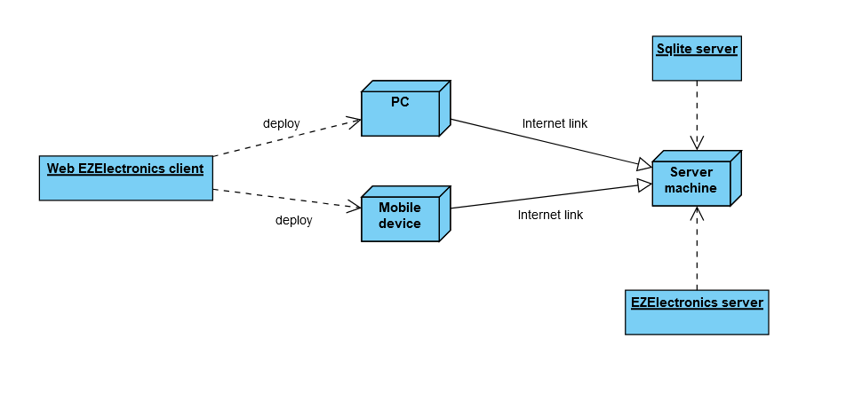

# Requirements Document - future EZElectronics

Date:

Version: V1 - description of EZElectronics in FUTURE form (as proposed by the team)

| Version number | Change |
| :------------: | :----: |
|                |        |

# Contents

- [Requirements Document - future EZElectronics](#requirements-document---future-ezelectronics)
- [Contents](#contents)
- [Informal description](#informal-description)
- [Stakeholders](#stakeholders)
- [Context Diagram and interfaces](#context-diagram-and-interfaces)
  - [Context Diagram](#context-diagram)
  - [Interfaces](#interfaces)
- [Stories and personas](#stories-and-personas)
    - [Stories](#stories)
- [Functional and non functional requirements](#functional-and-non-functional-requirements)
  - [Functional Requirements](#functional-requirements)
  - [Non Functional Requirements](#non-functional-requirements)
- [Use case diagram and use cases](#use-case-diagram-and-use-cases)
  - [Use case diagram](#use-case-diagram)
    - [Use case 1, UC1, Registrazione](#Use-case-1-UC1-Registrazione)

    - [Use case 2, UC2, Login](#Use-case-2-UC2-login)

    - [Use case 3, UC3, Logout](#Use-case-3-UC3-logout)
    - [Use case 4, UC5, Visualizza profilo](#Use-case-4-UC4-visualizza-profilo)
    - [Use case 5, UC5, Elimina account](#Use-case-5-UC5-elimina-account)
    - [Use case 6, UC6, Modifica account](#Use-case-6-UC6-modifica-account)
    - [Use case 7, UC7, Upgrade Account](#Use-case-7-UC7-upgrade-account)
    - [Use case 8, UC8, Crea nuovo modello](#Use-case-8-UC8-upgrade-account)
    - [Use case 9, UC9, Aggiunta nuovi proddotti](#Use-case-9-UC9-aggiunta-nuovi-prodotti)
    - [Use case 10, UC10, Eliminazione prodotto](#Use-case-10-UC10-eliminazione-prodotto)
    - [Use case 11, UC11, Eliminazione modello](#Use-case-11-UC11-eliminazione-modello)
    - [Use case 12, UC12, Ricerca prodotti con filtri](#Use-case-12-UC12-ricerca-prodotti-con-filtri)
    - [Use case 13, UC13, Ricerca modelli con filtri](#Use-case-13-UC13-ricerca-modelli-con-filtri)
    - [Use case 14, UC14, Visualizza modello](#Use-case-14-UC14-visualizza-modello)
    - [Use case 15, UC15, Visualizzazione carrello corrente](#Use-case-15-UC15-visualizzazione-carrello-corrente)
    - [Use case 16, UC16, Aggiunta prodotto al carrello corrente](#Use-case-16-UC16-aggiunta-prodotto-al-carrello-corrente)
    - [Use case 17, UC17, Pagamento carrello corrente](#Use-case-17-UC17-pagamento-carrello-corrente)
    - [Use case 18, UC18, Visualizzazione storico acquisti](#Use-case-18-UC18-visualizzazione-storico-acquisti)
    - [Use case 19, UC19, Eliminazione prodotto dal carrello corrente](#Use-case-19-UC19-eliminazione-prodotto-dal-carrello-corrente)
    - [Use case 20, UC20, Svuota carrello corrente](#Use-case-20-uc20-svuota-carrello-corrente)
  
- [Glossary](#glossary)
- [System Design](#system-design)
- [Deployment Diagram](#deployment-diagram)

# Informal description

EZElectronics (read EaSy Electronics) is a software application designed to help managers of electronics stores to manage their products and offer them to customers through a dedicated website. Managers can assess the available products, record new ones, and confirm purchases. Customers can see available products, add them to a cart and see the history of their past purchases.

# Stakeholders

| Stakeholder name | Description |
| :--------------: | :---------: |
| Cliente  |     L'utente che interagisce con il sistema per visualizzare o acquistare i prodotti        |
| Manager (free, pro) |     L'utente che interagisce con il sistema per gestire l'inventario e le vendite      |
| Software factory  |     Azienda che si occupa di sviluppare l'applicativo, di risolvere i bug in produzione        |
| Servizi di pagamento |     Aziende terze che si occupano di gestire i pagamenti che avvengono attraverso l’applicativo        |

# Context Diagram and interfaces

## Context Diagram

## Interfaces

|   Actor   | Logical Interface | Physical Interface |
| :-------: | :---------------: | :----------------: |
| Cliente | GUI( Visualizzare prodotti, aggiungere al carrello, acquistare prodotti ) |    Smartphone/PC/Tablet            |
| Manager |         GUI (Caricare/analizzare i prodotti)          |           PC         |
| Servizio di pagamento |          Sistemi di pagamento digitali          |           Internet       |

# Stories and personas

**Persona 1:** Giovanni (cliente) è uno studente di 19 anni, appassionato di elettronica, che sta per iscriversi all'università

**Persona 2:** Federica, ha 2 figli, ha 45 anni, una cliente abituale degli store elettronici.

**Persona 3:** Giulia, una signora di 51 anni, manager che si occupa della vendita al dettaglio nel suo negozio

### Stories

**Persona 1 Story:** Giovanni vuole comprare un nuovo computer più performante per intraprendere al meglio il nuovo percorso. 

**Persona 2 Story:** Federica, sta cercando dei despositivi elettronici per semplificare la gestione della casa, essendo molto impegnata tra lavoro e famiglia preferisce ordinare online.

**Persona 3 Story:** Giulia ha uno store fisico e vorrebbe digitalizzarsi per stare al passo con i tempi. Vorrebbe raggiungere un maggior numero di clienti per rendere più profittevole il proprio Business.

# Functional and non functional requirements

## Functional Requirements

|  ID   | Description |
| :---: | :---------: |
| FR1  |  Autenticazione e autorizzazione utente           |
| FR1.1  |  Login        |
| FR1.2  |  Logout      |
| FR1.3  |  Visualizza profilo utente      |
|||
|  FR2  |  Gestione utente           |
| FR2.1  |  Registrazione      |
| FR2.2  |  Elimina account      |
| FR2.3  |  Modifica account |
| FR2.4  |  Upgrade account |
|| |
|  FR3  |  Gestione prodotti            |
| FR3.1  |  Creazione nuovo modello    |
| FR3.2  |  Aggiunta nuovi prodotti    |
| FR3.3  |  Elimina prodotto    |
| FR3.4  |  Elimina modello        |
| FR3.5  |  Ricerca modelli con filtri   |
| FR3.7  |  Ricerca prodotti con filtri   |
| FR3.8  |  Visualizza modello   |
|||
|  FR4  |  Gestione carello           |
| FR4.1 |   Aggiunta prodotto al carrello     |
| FR4.2 |   Visualizzazione storico acquisti    |
| FR4.3 |   Visualizzazione carrello corrente  |
| FR4.4 |   Rimozione prodotto dal carrello    |
| FR4.5 |   Svuota carello    |
|||
|  FR5  |  Gestione pagamento           |
| FR5.1 |   Gestione dati pagamento    |
| FR5.2 |   Richiesta pagamento    |
|||

## Acces Rights
|   Funzione    | Utente | Cliente | Manager |
| :-----: | :--------------------------------: | :---------: | :-------: |
|  Registrazione  | x | | |
|  Login   | x | x | x |
|  Logout   |  | x | x |
|  Visualizza profilo  |  | x | x |
|  Elimina account  |  | x | x |
|  Modifica account   |  | x | x |
|  Upgrade accout   |  | | x(solo manager free) |
|  Crea nuovo modello   |  |  | x |
|  Aggiunta nuovi prodotti  |  |  | x |
|  Eliminazione prodotto  |  |  | x |
|  Eliminazione modello  |  |  | x |
|  Ricerca prodotti con filtri  |  |  | x |
|  Ricerca modelli con filtri  | x | x | x |
|  Visualizza modello |x  |x  | x |
|  Visualizzazione carrello corrente  |  | x |  |
|  Aggiunta prodotto al carrello corrente |  | x |  |
|  Pagamento carrello corrente |  | x |  |
|  Visualizzazione storico acquisti  |  | x |  |
|  Eliminazione prodotto dal carrello  corrente|  | x |  |
|   Svuota carello  corrente|  | x |  |

## Non Functional Requirements

|   ID    | Type (efficiency, reliability, ..) | Description | Refers to |
| :-----: | :--------------------------------: | :---------: | :-------: |
|  NFR1   |               Usability                     |    Utenti non devono necessitare di training          |     Clienti/Manager      |
|  NFR2   |         Efficiency                |        Il sito deve caricarsi in meno di 0.5s      |     Sito web      |
|  NFR3   |     Efficiency               |      Tutte le funzionalità dell’app devono completarsi in un tempo inferiore a 0.3s (escludendo la rete)         |       Sito web      |
|  NFR4   |     Affidability               |      Uptime > 98%        |       Server      |
|  NFR5  |     Portability               |       L’applicazione web deve essere disponibile per i browser    |       Server      |
|  NFR6  |     Security               |      La password deve essere salvata dopo essere stata crittografata (Hash)   |       Server      |

# Use case diagram and use cases

## Use case diagram

### Use case 1, UC1, Registrazione

| Actors Involved  |   Utente                                                                 |
| :--------------: | :------------------------------------------------------------------: |
|   Precondition   | - |
|  Post condition  |  Utente registrato   |
| Nominal Scenario |       L'utente appena arrivato sulla piattaforma vuole crearsi un account         |
|     Variants     |                     -                   |
|    Exceptions    |                     Scenario 1.2, 1.3      |

|  Scenario 1.1  |               Registrazione                                                             |
| :------------: | :------------------------------------------------------------------------: |
|   Precondition   | - |
|  Post condition  |  Utente registrato   |
|     Step#      |                                Description                                 |
|       1        |     Utente visita la piattaforma                                                                      |
|       2        |     La piattaforma richiede i dati personali e password                                                                       |
|      3       |        Inserisce i dati personali e password                                                                                           |

|  Scenario 1.2  |           Campi non compilati                                                            |
| :------------: | :------------------------------------------------------------------------: |
|   Precondition   | - |
|  Post condition  |  Registrazione fallita |
|     Step#      |                                Description                                 |
|       1        |      Visita la piattaforma                                                                      |
|       2        |     La piattaforma richiede i dati personali, password e ruolo                                                                       |
|      3       |        Utente non compila tutti i campi richiesti                                                                                           |
|      4       |       La piattaforma presenta un messaggio di errore                                                                               |

|  Scenario 1.3  |          Utente già registrato                  |
| :------------: | :------------------------------------------------------------------------: |
|   Precondition   | Utente possiede un account |
|  Post condition  |  Registrazione fallita |
|     Step#      |                                Description                                 |
|       1        |      Visita la piattaforma                                                                      |
|       2        |     La piattaforma richiede i dati personali e password                                                                       |
|      3       |        Utente inserisce i dati personali e password, ma lo username è già associato ad un altro account                                                                                            |
|      4       |       Sistema presenta un messaggio di errore                                          

### Use case 2, UC2, Login

| Actors Involved  |   Utente                                                                  |
| :--------------: | :------------------------------------------------------------------: |
|   Precondition   | -  |
|  Post condition  |  Utente autenticato all'accesso   |
| Nominal Scenario |       L'utente visita la piattaforma per accedere ai servizi         |
|     Variants     |                     -                   |
|    Exceptions    |                     Scenario 2.2              |

|  Scenario 2.1  |   Login                                                                         |
| :------------: | :------------------------------------------------------------------------: |
|   Precondition   | - |
|  Post condition  |  Utente autenticato all'accesso   |
|     Step#      |                                Description                                 |
|       1        |      Visita la piattaforma                                                                      |
|       2        |     La piattaforma richiede username e password                                                                      |
|      3       |        Inserisce username e password                                                                                           |
|      4       |        Username e password sono corretti, l'utente è loggato                                                                                           |
|||

|  Scenario 2.2 |  Campi username o password non compilati                                                                        |
| :------------: | :------------------------------------------------------------------------: |
|   Precondition   | - |
|  Post condition  |  Utente non loggato   |
|     Step#      |                                Description                                 |
|       1        |      Visita la piattaforma                                                                      |
|       2        |     La piattaforma richiede username e password                                                                      |
|      3       |        L'utente non inserisce username e/o password                                 |
|      4       |       Sistema presenta un messaggio di errore    |

|  Scenario 2.3 |  Campi username o password errati                                                                       |
| :------------: | :------------------------------------------------------------------------: |
|   Precondition   | - |
|  Post condition  |  Utente non loggato   |
|     Step#      |                                Description                                 |
|       1        |      Visita la piattaforma                                                                      |
|       2        |     La piattaforma richiede username e password                                                                      |
|      3       |        L'utente inserisce username e password                                 |
|      4       |       Il sistema verifica la corrispondenza username password nel db    |
|      5       |       Il controllo ha esito negativo, il sistema presenta un messaggio di errore    |

### Use case 3, UC3, Logout

| Actors Involved  |   Cliente, Manager                                                                   |
| :--------------: | :------------------------------------------------------------------: |
|   Precondition   | Utente autenticato |
|  Post condition  |  Utente non autenticato  |
| Nominal Scenario |       L'utente vuole uscire dalla piattaforma         |
|     Variants     |                     -                   |
|    Exceptions    |                     -               |

|  Scenario 3.1  |                                                                            |
| :------------: | :------------------------------------------------------------------------: |
|   Precondition   | Utente autenticato |
|  Post condition  |  Utente non autenticato  |
|     Step#      |                                Description                                 |
|       1        |      L'utente seleziona l'opzione di logout dalla sua pagina di profilo                                                                   |
|       2        |     il sistema esegue il logout                                                                      |

### Use case 4, UC4, Visualizza profilo

| Actors Involved  |   Cliente, Manager                                                                   |
| :--------------: | :------------------------------------------------------------------: |
|   Precondition   | Utente loggato |
|  Post condition  |  Informazioni profilo visualizzate  |
| Nominal Scenario |       L'utente vuole visualizzare i propri dati       |
|     Variants     |                     -                   |
|    Exceptions    |                     -               |

|  Scenario 4.1  |                                                                            |
| :------------: | :------------------------------------------------------------------------: |
|   Precondition   | Utente loggato |
|  Post condition  |  Informazioni profilo visualizzate  |
|     Step#      |                                Description                                 |
|       1        |      La piattaforma presenta username, name, surname e ruolo dell'utente loggato                                                              |

### Use case 5, UC5, Elimina account 

| Actors Involved  |   Cliente, Manager  |
| :--------------: | :------------------------------------------------------------------: |
|   Precondition   | Utente loggato |
|  Post condition  |  Account eliminato  |
| Nominal Scenario |       L'utente vuole eliminare il proprio account        |
|     Variants     |     - |
|    Exceptions    |           -               |

|  Scenario 5.1  |    Elimina account                                                        |
| :------------: | :------------------------------------------------------------------------: |
|   Precondition   | Utente loggato |
|  Post condition  |  Account eliminato  |
|     Step#      |                                Description                                 |
|       1        |      L'utente dalla pagina del suo profilo seleziona l'opzione elimina account                                                                    |
|       2        |     La piattaforma elimina definitivamente l'account dell'utente                                                                      |

### Use case 6, UC6, Modifica account 

| Actors Involved  |   Cliente, Manager                                                              |
| :--------------: | :------------------------------------------------------------------: |
|   Precondition   | Utente loggato |
|  Post condition  |  Dati account modificati  |
| Nominal Scenario |       L'utente vuole modificare i dati del proprio account    |
|     Variants     |                     -              |
|    Exceptions    |        scenario 6.2     |

|  Scenario 6.1  |     Modifica account                                 |
| :------------: | :------------------------------------------------------------------------: |
|   Precondition   | Utente loggato |
|  Post condition  |  Dati account modificati  |
|     Step#      |                                Description                                 |
|       1        |   L'utente dalla pagina del suo profilo seleziona l'opzione modifica account |
|       2        |     La piattaforma presenta un form modificabile, già compilato con i vecchi dati                                             |
|       3        |     L'utente seleziona i campi che vuole modificare e conferma le modifiche                  |
|       4        |     La piattaforma controlla che i campi siano compilati                           |
|       5        |     Il controllo va a buon fine, la piattaforma esegue la modifica        |

|  Scenario 6.2  |     Campi non compilati                |
| :------------: | :------------------------------------------------------------------------: |
|   Precondition   | Utente loggato |
|  Post condition  |  Dati account non modificati  |
|     Step#      |                                Description                                 |
|       1        |   L'utente dalla pagina del suo profilo seleziona l'opzione modifica account |
|       2        |     La piattaforma presenta un form modificabile, già compilato con i vecchi dati                                             |
|       3        |     L'utente seleziona i campi che vuole modificare e conferma le modifiche                 |
|       4        |     La piattaforma controlla che i campi siano compilati      |
|       5        |     Il controllo non va a buon fine, la piattaforma non effettua le modifiche e presenta un messagio di errore       |

### Use case 7, UC7, Upgrade Account 

| Actors Involved  |   Manager free                                                             |
| :--------------: | :------------------------------------------------------------------: |
|   Precondition   | Manager loggato, account free |
|  Post condition  |  Upgrade ad account pro |
| Nominal Scenario |       L'utente vuole estendere il suo account alla versione pro|
|     Variants     |                     -              |
|    Exceptions    |        scenario 7.2      |

|  Scenario 7.1  |    Upgrade account                        |
| :------------: | :------------------------------------------------------------------------: |
|   Precondition   | Manager loggato, account free |
|  Post condition  |  Upgrade ad account pro  |
|     Step#      |                                Description             
|       1        |Il manager free vuole estendere il suo account alla versione pro                      |
|       2        |     Il manager free dalla pagina del suo profilo seleziona l'opzione "Upgrade a pro"                                             |
|       3       |     La piattaforma presenta una pagina che elenca i vantaggi della versione pro ed un pulsante "Procedi al pagamento"  |
|       4        |    L'utente preme il pulsante "Procedi al pagamento"   |
|       5        |    La piattaforma apre una finestra, con un form complabile che richiede il metodo di pagamento e i relativi dati   |
|       6        |    L'utente inserisce i dati di pagamento  |
|       7        |    La piattaforma controlla se il pagamento va a buon fine (I dati sono corretti e il traffico residuo è pari o superiore all'importo necessario)   |
|       8        |    Il controllo dà esito positivo e la piattaforma presenta un messaggio di conferma   |

|  Scenario 7.2  |    Pagamento non andato a buon fine                        |
| :------------: | :------------------------------------------------------------------------: |
|   Precondition   | Manager loggato, account free |
|  Post condition  |  Ancora account free |
|     Step#      |                                Description 
|       1        |Il manager free vuole estendere il suo account alla versione pro                      |
|       2        |     Il manager free dalla pagina del suo profilo seleziona l'opzione "Upgrade a pro"                                             |
|       3       |     La piattaforma presenta una pagina che elenca i vantaggi della versione pro ed un pulsante "Procedi al pagamento"  |
|       4        |    L'utente preme il pulsante "Procedi al pagamento"   |
|       5        |    L'utente preme il pulsante   |
|       6        |    La piattaforma apre una finestra, con un form complabile che chiede il metodo di pagamento e i relativi dati   |
|       7        |    L'utente sceglie il metodo di pagamento e inserisce i relativi dati   |
|       8        |    La piattaforma controlla se il pagamento va a buon fine (I dati sono corretti e il traffico residuo è pari o superiore all'importo necessario)   |
|       9        |   Il controllo dà esito negativo e la piattaforma presenta un messaggio di errore   |

### Use case 8, UC8, Crea nuovo modello

| Actors Involved  |  Manager                                                         |
| :--------------: | :------------------------------------------------------------------: |
|   Precondition   | Manager loggato |
|  Post condition  | Modello creato e aggiunto al db  |
| Nominal Scenario |       Il Manager vuole creare un nuovo modello di prodotto       |
|     Variants     |                   -
|    Exceptions    |                     Scenario 8.2, 8.3 |

|  Scenario 8.1  |          Crea nuovo modello                                                                   |
| :------------: | :------------------------------------------------------------------------: |
|   Precondition   | Manager loggato  |
|  Post condition  | Modello creato e aggiunto al db  |
|     Step#      |                                Description                                 |
|       1        |      Il Manager vuole creare un nuovo modello di prodotto                                                                    |
|       2        |      Il Manager dalla pagina modelli seleziona l'opzione crea nuovo modello                                                                    |
|       3        |     La piattaforma attraverso un form chiede modello, categoria, dettagli, prezzo di vendita, quantità     |
|       4        |     Il Manager inserisce modello, categoria, dettagli, prezzo di vendita e quantità.                                                      |
|       5        |     Il Manager conferma l'inserimento                 |
|       6      |   Il sistema controlla che il manager free non abbia superato il limite di modelli inseribili gratuitamente e che il modello non sia già esistente |
|       7      |   Il controllo va a buon fine, la piattaforma crea il modello desiderato e assegna al modello lo username del manager loggato. In base alla quantità inserita vengono creati un numero corrispondente di prodotti definiti come segue: codice (incrementale), data di arrivo, data di vendita, modello, username del cliente che lo acquisterà (null fino all'acquisto)   | 

|  Scenario 8.2  |Modello   già esistente                                                                |
| :------------: | :------------------------------------------------------------------------: |
|   Precondition   | Manager loggato  |
|  Post condition  | Modello non creato  |
|     Step#      |                                Description                                 |
|       1        |      Il Manager vuole creare un nuovo modello di prodotto                                                                    |
|       2        |      Il Manager dalla pagina modelli seleziona l'opzione crea nuovo modello                                                                    |
|       3        |     La piattaforma attraverso un form chiede modello, categoria, dettagli, prezzo di vendita, quantità                             |
|       4        |     Il Manager inserisce modello, categoria, dettagli, prezzo di vendita e quantità                                               |
|       5       |   Il sistema controlla che il manager free non abbia superato il limite di modelli inseribili gratuitamente e che il modello non sia già esistente |
|       6       |   Il modello è già esistente, il modello non viene creato e viene presentato un messaggio di errore  | 

|  Scenario 8.3  |    Limite modelli superato     |
| :------------: | :------------------------------------------------------------------------: |
|   Precondition   | Manager loggato |
|  Post condition  | Modello non creato  |
|     Step#      |                                Description                                 |
|       1        |      Il Manager vuole creare un nuovo modello di prodotto                                                                    |
|       2        |      Il Manager dalla pagina modelli seleziona l'opzione crea nuovo modello                                                                    |
|       3        |     La piattaforma attraverso un form chiede modello, categoria, dettagli, prezzo di vendita, quantità                             |
|       4        |     Il Manager inserisce modello, categoria, dettagli, prezzo di vendita e quantità                                           |
|       5       |   Il sistema controlla che il manager free non abbia superato il limite di modelli inseribili gratuitamente e che il modello non sia già esistente |
|       6       |   Il manager free ha superato la soglia limite, il modello non viene creato e viene presentato un messaggio di errore   | 

### Use case 9, UC9, Aggiunta nuovi prodotti

| Actors Involved  |  Manager                                                         |
| :--------------: | :------------------------------------------------------------------: |
|   Precondition   | Manager loggato |
|  Post condition  | Prodotti creati e aggiunti al db  |
| Nominal Scenario |       Il Manager vuole aggiungere uno o più prodotti al db       |
|     Variants     |                -
|    Exceptions    |       -  |

|  Scenario 9.1  |       Aggiunta nuovi prodotti                                |
| :------------: | :------------------------------------------------------------------------: |
|   Precondition   | Manager loggato |
|  Post condition  | Prodotti creati e aggiunti al db  |
|     Step#      |                                Description                                 |
|       1        |      Il Manager vuole aggiungere uno o più prodotti al db      |
|       2        |      Il Manager dalla pagina dei prodotti seleziona l'opzione aggiungi prodotti                                                                    |
|       3        |     La piattaforma attraverso un form chiede modello(menù a tendina) e quantità                          |
|       4        |     Il Manager inserisce quantità e modello  |
|       5        |     Il Manager conferma l'operazione  |
|       6        |     Il sistema crea un numero di prodotti corrispondente alla quantità inserita, definiti come segue: codice(incrementale), data di arrivo(data corrente di default), data di vendita(nulla di default), modello, username del cliente che lo acquisterà (null fino all'acquisto) |

### Use case 10, UC10, Eliminazione prodotto 

| Actors Involved  |  Manager                                                  |
| :--------------: | :------------------------------------------------------------------: |
|   Precondition   | Manager loggato |
|  Post condition  | Prodotto eliminato |
| Nominal Scenario |       Un manager vuole eliminare un suo prodotto |
|     Variants     |                    -            |
|    Exceptions    |         -     |

|  Scenario 10.1  |        Eliminazione prodotto                                                                    |
| :------------: | :------------------------------------------------------------------------: |
|   Precondition   | Manager loggato|
|  Post condition  | Prodotto eliminato|
|     Step#      |                                Description                                 |
|       1        |      Un manager vuole eliminare un suo prodotto                                                     |
|       2        |     Il manager dalla pagina dei suoi prodotti seleziona l'opzione elimina relativa al prodotto che desidera eliminare                     |
|       3        |     Il manager conferma l'operzione                                                     |
| 4 | La piattaforma elimina il prodotto | 

### Use case 11, UC11, Eliminazione modello 

| Actors Involved  |  Manager                                                  |
| :--------------: | :------------------------------------------------------------------: |
|   Precondition   | Manager loggato |
|  Post condition  | Modello eliminato |
| Nominal Scenario |       Un manager vuole eliminare un suo modello |
|     Variants     |                    -            |
|    Exceptions    |         -    |

|  Scenario 11.1  |        Eliminazione modello                                                                    |
| :------------: | :------------------------------------------------------------------------: |
|   Precondition   | Manager loggato|
|  Post condition  | Modello eliminato|
|     Step#      |                                Description                                 |
|       1        |      Un manager vuole eliminare un suo modello                                                     |
|       2        |     Il manager dalla pagina dei suoi modelli seleziona l'opzione elimina relativa al modello che desidera eliminare                     |
|       3        |     Il manager conferma l'operzione                                                     |
| 4 | La piattaforma elimina il modello e tutti i prodotti di quel modello | 

### Use case 12, UC12,  Ricerca prodotti con filtri

| Actors Involved  |  Manager  |
| :--------------: | :------------------------------------------------------------------: |
|   Precondition   |Manager loggato |
|  Post condition  | Prodotti filtrati e visualizzati |
| Nominal Scenario |       Un manager vuole visualizzare i suoi prodotti |
|     Variants     |                    -            |
|    Exceptions    |         Scenario 12.2       |

|  Scenario 12.1 |                Ricerca prodotti con filtri                                                            |
| :------------: | :------------------------------------------------------------------------: |
|   Precondition   | Manager loggato |
|  Post condition  |Prodotti visualizzati|
|     Step#      |                                Description                                 |
|       1        |      Un manager vuole visualizzare i suoi prodotti                                                        |
|       2        |        Il manager dalla pagina dei suoi prodotti (il manager visualizza di default solo i prodotti associati al proprio username) inserisce i filtri di ricerca: modello(form)      |
|       3        |     Il manager applica il filtro               |
| 4 | Il sistema controlla che il modello inserito (se inserito) esista|
| 5 | Il controllo ha esito positivo, la piattaforma mostra i prodotti filtrati|  

|  Scenario 12.2  |     Codice modello inesistente                                                                     |
| :------------: | :------------------------------------------------------------------------: |
|   Precondition   | Manager loggato |
|  Post condition  |Prodotti non visualizzati|
|     Step#      |                                Description                                 |
|       1        |      Un manager vuole visualizzare i suoiprodotti                                                        |
|       2        |        Il manager dalla pagina dei suoi prodotti (il manager visualizza di default solo i prodotti associati al proprio username) inserisce i filtri di ricerca: modello(form)                   |
|       3        |     Il manager applica il filtro               |
| 4 | Il sistema controlla che il modello inserito (se inserito) esista|
| 5 | Il controllo ha esito negativo, la piattaforma mostra un messaggio di errore|   

### Use case 13, UC13,  Ricerca modelli con filtri

| Actors Involved  |  Manager, Cliente, Utente                                                        |
| :--------------: | :------------------------------------------------------------------: |
|   Precondition   | - |
|  Post condition  | Modelli filtrati e visualizzati |
| Nominal Scenario |       Un utente vuole visualizzare i modelli |
|     Variants     |                    Manager(visualizza solo i modelli associati al proprio username), Cliente/utente non loggato(visualizza tutti i modelli)            |
|    Exceptions    |         Scenario 13.2       |

|  Scenario 13.1 |                Ricerca modelli con filtri                                                            |
| :------------: | :------------------------------------------------------------------------: |
|   Precondition   | - |
|  Post condition  |Modelli visualizzati|
|     Step#      |                                Description                                 |
|       1        |      Un utente vuole visualizzare i modelli                                                        |
|       2        |        L'utente dalla pagina dei modelli inserisce i filtri di ricerca: modello(form) o categoria(menù a scelta)                  |
|       3        |     L'utente applica il filtro               |
| 4 | Il sistema controlla che il modello inserito (se inserito) esista|
| 5 | Il controllo ha esito positivo, la piattaforma mostra i modelli filtrati come segue: immagine, modello, prezzo|  

|  Scenario 13.2  |     Codice modello inesistente                                                                     |
| :------------: | :------------------------------------------------------------------------: |
|   Precondition   | - |
|  Post condition  |Modelli non visualizzati|
|     Step#      |                                Description                                 |
|       1        |      Un utente vuole visualizzare i modelli                                                        |
|       2        |        L'utente dalla pagina dei modelli inserisce i filtri di ricerca: modello(form) o categoria(menù a scelta)                  |
|       3        |     L'utente applica il filtro               |
| 4 | Il sistema controlla che il modello inserito (se inserito) esista|
| 5 | Il controllo ha esito negativo, la piattaforma mostra un messaggio di errore|

### Use case 14, UC14,  Visualizza modello

| Actors Involved  |  Manager, Cliente, Utente                                                        |
| :--------------: | :------------------------------------------------------------------: |
|   Precondition   | - |
|  Post condition  | Modelli filtrati e visualizzati |
| Nominal Scenario |       Un utente vuole visualizzare i modelli |
|     Variants     |      Cliente/utente non loggato(dispongono del pulsante aggiungi al carrello), manager(non dispone del pulsante aggiungi al carrello)            |
|    Exceptions    |       -     |

|  Scenario 14.1 |               Visualizza modello                                                           |
| :------------: | :------------------------------------------------------------------------: |
|   Precondition   | - |
|  Post condition  |Modello visualizzato|
|     Step#      |                                Description                                 |
|       1        |      Un utente vuole visualizzare un modello                                                |
|       2        |       L'utente seleziona un modello dalla pagina dei modelli |
|       3        |     Il sistema presenta il modello con i relativi dettagli       |  
  
### Use case 15, UC15, Visualizzazione carrello corrente

| Actors Involved  |  Cliente                                                 |
| :--------------: | :------------------------------------------------------------------: |
|   Precondition   | Cliente loggato |
|  Post condition  | Carrello corrente visualizzato |
| Nominal Scenario |       Il cliente vuole visualizzare il proprio carrello corrente |
|     Variants     |                    -            |
|    Exceptions    |         -     |

|  Scenario 15.1  |     Visualizzazione carrello corrente                                                                       |
| :------------: | :------------------------------------------------------------------------: |
|   Precondition   | Cliente loggato |
|  Post condition  | Carrello corrente visualizzato |
|     Step#      |                                Description                                 |
|       1        |      Il cliente vuole visualizzare il proprio carrello corrente, ovvero il carrello associato al suo username, cliccando sull'icona carrello                                                    |
|       2        |      La piattaforma visualizza il carrello corrente dell'utente                    |

### Use case 16, UC16, Aggiunta prodotto al carrello corrente

| Actors Involved  |  Cliente                                                 |
| :--------------: | :------------------------------------------------------------------: |
|   Precondition   | Cliente loggato |
|  Post condition  | Prodotto aggiunto al carrello corrente |
| Nominal Scenario |       Il cliente vuole aggiungere un prodotto al carrello corrente |
|     Variants     |                    -            |
|    Exceptions    |         - |

|  Scenario 16.1  |    Aggiunta prodotto al carrello corrente                                                                        |
| :------------: | :------------------------------------------------------------------------: |
|   Precondition   |Cliente loggato |
|  Post condition  | Prodotto aggiunto al carrello corrente |
|     Step#      |                                Description                                 |
|       1        |      Il cliente vuole aggiungere un prodotto al proprio carrello |   
|       2        |      Il cliente dalla pagina di visualizzazione del modello, seleziona l'opzione aggiungi al carrello |      
|       3      |      La piattaforma aggiunge il prodotto al carrello corrente dell'utente                    |

### Use case 17, UC17, Pagamento carrello corrente

| Actors Involved  |  Cliente                                                 |
| :--------------: | :------------------------------------------------------------------: |
|   Precondition   | Cliente loggato|
|  Post condition  | Carrello pagato |
| Nominal Scenario |       Il cliente vuole pagare il proprio carrello corrente |
|     Variants     |                    -            |
|    Exceptions    |         Scenario 17.2  |

|  Scenario 17.1  |    Pagamento carrello corrente                                                                        |
| :------------: | :------------------------------------------------------------------------: |
|   Precondition   | Cliente loggato|
|  Post condition  | Carrello pagato |
|     Step#      |                                Description                                 |
|       1        |      Il cliente vuole pagare il proprio carrello corrente | 
|       2        |      Il cliente seleziona la pagina del carrello corrente |        
|       3        |      La piattaforma presenta il riepilogo del carrello e il prezzo totale                              |   
|       4        |     Il cliente preme il pulsante "Procedi  al pagamento" che compare solo se il carrello non è vuoto                                  |
|       5        |    La piattaforma apre una finestra, con un form compilabile che chiede i dati di pagamento|
|       6        |    L'utente inserisce i dati di pagamento  |
|       7        |   La piattaforma controlla se il pagamento va a buon fine (I dati sono corretti e il traffico residuo è pari o superiore all'importo necessario)   |
|       9        |    Il controllo dà esito positivo, la piattaforma presenta un messaggio di conferma   |
|       10       |   La piattaforma aggiorna con la data corrente la data di vendita del prodotto, aggiorna il campo username del cliente che lo acquista con lo username del cliente loggato, decrementa il campo quantità del modello corrispondente e segna come pagato il carrello|

|  Scenario 17.2 |    Pagamento non riuscito                                               |
| :------------: | :------------------------------------------------------------------------: |
|   Precondition   | Cliente loggato|
|  Post condition  | Carrello non pagato |
|     Step#      |                                Description                                 |
|       1        |      Il cliente vuole pagare il proprio carrello corrente | 
|       2        |      Il cliente seleziona la pagina del carrello corrente |        
|       3        |      La piattaforma presenta il riepilogo del carrello e il prezzo totale                              |   
|       4        |     Il cliente preme il pulsante "Procedi  al pagamento" che compare solo se il carrello non è vuoto                                  |
|       5        |    La piattaforma apre una finestra, con un form compilabile che chiede i dati di pagamento|
|       6        |    L'utente inserisce i dati pagamento  |
|       7        |   La piattaforma controlla se il pagamento va a buon fine (I dati sono corretti e il traffico residuo è pari o superiore all'importo necessario)   |
|       9        |    Il controllo dà esito negativo, la piattaforma presenta un messaggio di errore   |

### Use case 18, UC18, Visualizzazione storico acquisti

| Actors Involved  |  Cliente                                                 |
| :--------------: | :------------------------------------------------------------------: |
|   Precondition   | Cliente loggato|
|  Post condition  | Storico visualizzato |
| Nominal Scenario |       Il cliente vuole visualizzare il proprio storico acquisti |
|     Variants     |                    -            |
|    Exceptions    |         -    |

|  Scenario 18.1  |       Visualizzazione storico acquisti                                                                     |
| :------------: | :------------------------------------------------------------------------: |
|   Precondition   | Cliente loggato |
|  Post condition  | Storico visualizzato |
|     Step#      |                                Description                                 |
|       1        |      Il cliente vuole visualizzare il proprio storico acquisti |  
|       2        |      Il cliente dal menù seleziona la voce "Storico acquisti" |        
|       3        |      La piattaforma presenta lo storico acquisti dell'utente visualizzando immagine, modello e prezzo                    |

### Use case 19, UC19, Eliminazione prodotto dal carrello corrente

| Actors Involved  |  Cliente                                                 |
| :--------------: | :------------------------------------------------------------------: |
|   Precondition   | Cliente loggato|
|  Post condition  | Prodotto eliminato dal proprio carello corrente|
| Nominal Scenario |       Il cliente vuole rimuovere un prododotto dal proprio carrello corrente |
|     Variants     |                    -            |
|    Exceptions    |     -|

|  Scenario 19.1  |           Eliminazione prodotto dal carrello corrente                                                                 |
| :------------: | :------------------------------------------------------------------------: |
|   Precondition   | Cliente loggato |
|  Post condition  | Prodotto eliminato dal proprio carello corrente|
|     Step#      |                                Description                                 |
|       1        |      Il cliente vuole rimuovere un prodotto dal proprio carrello corrente  |   
|       2        |      Il cliente seleziona l'opzione rimuovi dal carrello, per il prodotto desiderato |     
|       3        |      La piattaforma elimina il prodotto dal carrello corrente del cliente                 |

### Use case 20, UC20, Svuota carrello corrente

| Actors Involved  |  Cliente                                                 |
| :--------------: | :------------------------------------------------------------------: |
|   Precondition   | Cliente loggato |
|  Post condition  | Carrello corrente vuoto|
| Nominal Scenario |       Il cliente vuole svuotare il proprio carrello corrente |
|     Variants     |                    -            |
|    Exceptions    |       -  |

|  Scenario 20.1  |           Svuota carrello corrente                                                                 |
| :------------: | :------------------------------------------------------------------------: |
|   Precondition   | Cliente loggato |
|  Post condition  | Carrello corrente vuoto |
|     Step#      |                                Description                                 |
|       1        |      Il cliente vuole svuotare il proprio carrello corrente  |
|       2        |      Il cliente dalla pagina del carrello seleziona la voce "Svuota carrello" presente solo se il carrello non è vuoto                  |        
|       3        |      La piattaforma svuota il carrello corrente dell'utente                    |

# Glossary

# System Design

# Deployment Diagram

