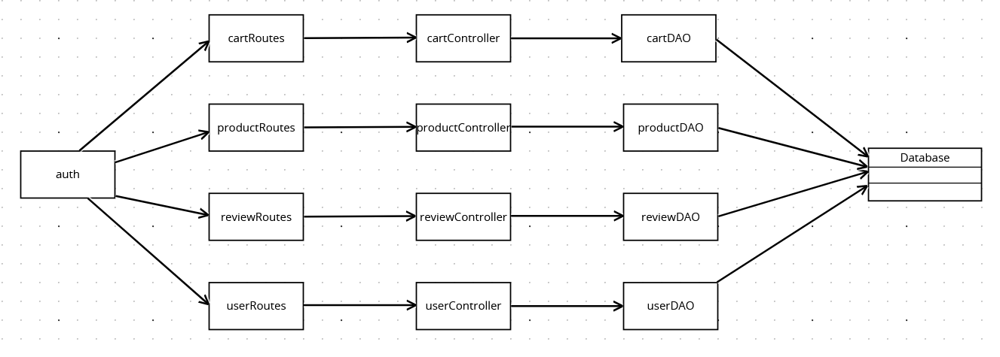
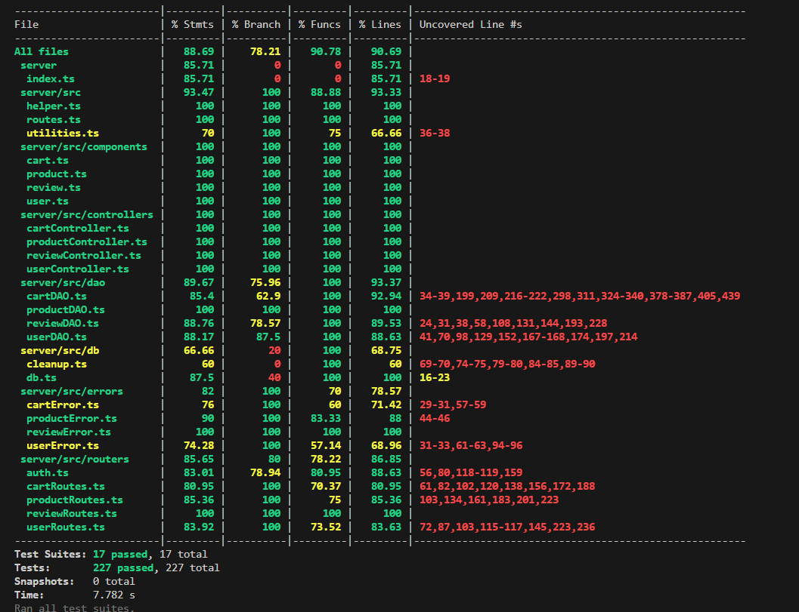

# Test Report

<The goal of this document is to explain how the application was tested, detailing how the test cases were defined and what they cover>

# Contents

- [Test Report](#test-report)
- [Contents](#contents)
- [Dependency graph](#dependency-graph)
- [Integration approach](#integration-approach)
- [Tests](#tests)
  - [Coverage of FR](#coverage-of-fr)
  - [Coverage white box](#coverage-white-box)

# Dependency graph

       

# Integration approach

    <Write here the integration sequence you adopted, in general terms (top down, bottom up, mixed) and as sequence

    (ex: step1: unit A, step 2: unit A+B, step 3: unit A+B+C, etc)>

    <Some steps may  correspond to unit testing (ex step1 in ex above)>

    <One step will  correspond to API testing, or testing unit route.js>

    Abbiamo usato un approccio mixed, sviluppando inizialmente i test del controller. Successivamente abbiamo testato il Dao, perché strettamente legato al controller. Poi abbiamo testato le routes e infine abbiamo implementato gli integration test.

# Tests

<in the table below list the test cases defined For each test report the object tested, the test level (API, integration, unit) and the technique used to define the test case (BB/ eq partitioning, BB/ boundary, WB/ statement coverage, etc)> <split the table if needed>
| Test case name | Object(s) tested | Test level | Technique used |
| :------------: | :--------------: | :--------: | :------------: |
|**UNIT TESTS**|
|**CONTROLLER TESTS**|
|**Cart Controller Tests**|
| addToCart -> It should add product to cart for customer and return true |       Controller + DAO           |  Controller          |WB - Eq partitioning                |
| addToCart -> It should return UserNotCustomerError for non-customer role|              Controller    |            Controller|        WB - Statement Coverage         |
| getCart -> It should return the cart for a customer|Controller + DAO                  |            Controller|                WB - Eq partitioning|
| getCart ->  It should throw UserNotCustomerError for non-customer role|Controller   |        Controller    |      WB - Boundary          |
| checkoutCart -> It should successfully checkout the cart for a customer|         Controller + DAO         |   Controller         |         WB - Eq partitioning       |
| checkoutCart -> It should throw UserNotCustomerError for non-customer role|                Controller + DAO  |    Controller        |     WB - Statement Coverage            |
| checkoutCart -> It should throw CartNotFoundError if no current cart exists|                  Controller + DAO|   Controller         |          WB - Boundary      |
| checkoutCart -> It should throw EmptyCartError if the current cart is empty|Controller + DAO                  |  Controller          |        WB - Boundary        |
| checkoutCart -> It should throw EmptyProductStockError if any product in the cart is out of stock |Controller + DAO                  |     Controller       |       WB - Boundary         |
| checkoutCart -> It should throw LowProductStockError if any product in the cart has insufficient stock|      Controller + DAO            |    Controller        |     WB - Boundary           |
| getCustomerCarts -> It should return all paid carts for a customer|Controller + DAO                  |          Controller  |    WB - Eq partitioning            |
| getCustomerCarts -> It should throw UserNotCustomerError for non-customer role |Controller                  |      Controller      |        WB - Statement Coverage         |
| removeProductFromCart -> It should remove a product from the cart for a customer|         Controller + DAO         |   Controller         | WB - Eq partitioning               |
| removeProductFromCart -> It should throw UserNotCustomerError for non-customer role| Controller + DAO  |    Controller        |     WB - Statement Coverage            |
| removeProductFromCart -> It should throw ProductNotFoundError if the product does not exist| Controller + DAO|    Controller            |WB - Boundary
| removeProductFromCart -> It should throw CartNotFoundError if the cart does not exist|                  Controller + DAO|     Controller       |        WB - Boundary        |
| removeProductFromCart -> It should throw ProductNotInCartError if the product is not in the cart|                Controller + DAO  | Controller           |     WB - Boundary           |
| clearCart -> It should clear the cart for a customer|                  Controller + DAO|       Controller     |       WB - Eq partitioning        |
| clearCart -> It should throw UserNotCustomerError for non-customer role|         Controller         |   Controller         |   WB - Statement Coverage              |
| clearCart -> It should throw CartNotFoundError if the cart does not exist|                 Controller + DAO |        Controller    |         WB - Boundary       |
| deleteAllCarts -> It should delete all carts|                  Controller + DAO|   Controller         |           WB - Eq partitioning     |
| deleteAllCarts -> It should handle errors when deleting all carts |      Controller  + DAO           |    Controller        |     WB - Boundary           |
| getAllCarts -> It should retrieve all carts|                  Controller + DAO|   Controller         |          WB - Eq partitioning     |
| getAllCarts -> It should handle errors when retrieving all carts|       Controller  + DAO          |    Controller        |        WB - Boundary        |
||
|**Product Controller Tests**|
| registerProducts -> It should return nothing|           Controller  + DAO       |     Controller       |        WB - Eq partitioning        |
| changeProductQuantity -> It should return the product quantity and return the updated quantity|   Controller  + DAO   |    Controller   |     WB - Eq partitioning     |
| sellProduct -> It should return the product quantity and return the updated quantity| Controller  + DAO                 |   Controller         |     WB - Eq partitioning           |
| getProducts -> It should return a list of products| Controller  + DAO                 |     Controller       |         WB - Eq partitioning       |
| getProducts -> It should return a list of products by a specific category| Controller  + DAO                 |        Controller    |      WB - Eq partitioning          |
| getProducts -> It should return a list of products by a specific model|Controller  + DAO                  |     Controller       |          WB - Eq partitioning      |
| getAvailableProducts -> It should return a list of available products (quantity > 0) without grouping| Controller  + DAO          |  Controller              |WB - Eq partitioning
| getAvailableProducts -> It should return a list of available products (quantity > 0) grouped by category | Controller  + DAO                 |     Controller       |              WB - Eq partitioning  |
| getAvailableProducts -> It should return a list of available products (quantity > 0) grouped by model| Controller  + DAO                |     Controller       |            WB - Eq partitioning    |
| deleteAllProducts -> It should delete all products and return true |Controller  + DAO                  |     Controller       |          WB - Eq partitioning      |
| deleteProduct -> It should delete a product by model and return true|   Controller  + DAO               |   Controller         |         WB - Eq partitioning       |
||
|**Review Controller Tests**|
| addReview -> check addReview  |     Controller  + DAO            |    Controller        |    WB - Eq partitioning              |
| getProductReviews ->check getProductReviews|    Controller  + DAO              |  Controller           |             WB - Eq partitioning     |
| deleteReview ->check deleteReview|            Controller  + DAO      |  Controller           |                 WB - Eq partitioning |
| checkdeleteReviewsOfProduct -> deleteReviewsOfProduct|   Controller  + DAO               |  Controller           |                 WB - Eq partitioning |
| deleteAllReviews -> check deleteAllReviews|      Controller  + DAO            |   Controller          |                 WB - Eq partitioning |
||
|**User Controller Tests**|
| createUser -> It should return true|                 Controller  + DAO            |   Controller            |         WB - Eq partitioning       |
| getUsers -> It should return a list of users|                 Controller  + DAO            |   Controller            |              WB - Eq partitioning  |
| getUsersByRole -> It should return a list of users with a specific role|                  Controller  + DAO            |   Controller             |        WB - Eq partitioning        |
| getUserByUsername -> Admin should be able to get any user by username|                  Controller             |   Controller            |               WB - Eq partitioning |
| getUserByUsername -> Non-admin user should be able to get their own data|                  Controller              |   Controller            |               WB - Eq partitioning |
| getUserByUsername -> Non-admin user should not be able to get data of other users|                  Controller             |   Controller            |                WB - Statement coverage|
| deleteUser -> Admin should be able to delete any non-admin user|                 Controller  + DAO            |   Controller           |         WB - Eq partitioning       |
| deleteUser -> Non-admin user should be able to delete their account|                 Controller  + DAO            |   Controller            |     WB - Eq partitioning           |
| deleteUser -> Non-admin user should not be able to delete other users|                 Controller  + DAO            |   Controller            |   WB - Statement coverage            |
| deleteUser -> Admin should not be able to delete another admin user|                  Controller  + DAO            |   Controller             |  WB - Statement coverage             |
| updateUserInfo -> User should be able to update their own information|                  Controller  + DAO            |   Controller            |                WB - Eq partitioning|
| deleteAll -> It should delete all users and return true|                 Controller  + DAO            |   Controller             |                WB - Eq partitioning|
||
||
||
||
|**DAO TESTS**|
|**Cart DAO tests**|
| getCart -> should return an empty cart when no cart exists for the user | DAO|DAO | WB - Boundary|
| addToCart -> should add a product to a new cart | DAO|DAO| WB - Eq partitioning|
| getAllCarts -> should return all carts | DAO|DAO | WB - Eq partitioning|
| addToCart -> should throw ProductNotFoundError when product does not exist | DAO|DAO | WB - Boundary|
| addToCart -> should throw EmptyProductStockError when product is out of stock |  DAO|DAO |WB - Boundary |
| checkoutCart -> should successfully checkout a cart | DAO|DAO|WB - Eq partitioning |
| checkoutCart -> should throw CartNotFoundError when there is no current cart for the user | DAO|DAO|WB - Boundary |
| checkoutCart -> should throw EmptyCartError when the current cart is empty |  DAO|DAO | WB - Boundary|
| checkoutCart -> should throw EmptyProductStockError when any product in the cart is out of stock |  DAO|DAO |WB - Boundary |
| checkoutCart -> should throw LowProductStockError when any product in the cart has insufficient stock |  DAO|DAO |WB - Boundary |
| getCustomerCarts -> should return customer carts with products |  DAO|DAO |WB - Eq partitioning |
| getCustomerCarts -> should return an empty array when the customer has no paid carts |  DAO|DAO |WB - Boundary |
| getCustomerCarts -> should reject when there is a database error |  DAO|DAO |WB - Boundary |
| getCustomerCarts -> should reject when there is a database error fetching products |  DAO|DAO |WB - Statement Coverage |
| removeProductFromCart -> should remove a product from the cart by decreasing its quantity |  DAO|DAO |WB - Eq partitioning |
| removeProductFromCart -> should remove a product from the cart by deleting it when quantity is 1 |  DAO|DAO |WB - Eq partitioning |
| removeProductFromCart -> should throw ProductNotFoundError when the product does not exist |  DAO|DAO |WB - Boundary |
| removeProductFromCart -> should throw CartNotFoundError when there is no current cart for the user | DAO|DAO |WB - Boundary |
| removeProductFromCart -> should throw ProductNotInCartError when the product is not in the cart |  DAO|DAO |WB - Boundary |
| clearCart -> should clear the cart successfully |  DAO|DAO | WB - Eq partitioning|
| clearCart -> should throw CartNotFoundError when there is no current cart for the user |  DAO|DAO |WB - Boundary |
| clearCart -> should handle error when deleting products from cart | DAO|DAO |WB - Boundary |
| clearCart -> should handle error when updating cart total |  DAO|DAO |WB - Boundary |
| deleteAllCarts -> should delete all carts successfully |  DAO|DAO |WB - Statement coverage |
| deleteAllCarts -> should handle error when deleting all carts |  DAO|DAO | WB - Boundary|
| getAllCarts -> should return an empty list when no carts are found |  DAO|DAO |WB - Boundary |
| getAllCarts -> should handle a database error when fetching carts |  DAO|DAO |WB - Statement coverage |
| getAllCarts -> should handle a database error when fetching products for a cart |  DAO|DAO |WB - Statement coverage |
| getAllCarts -> should return all carts with their associated products |  DAO|DAO |WB - Eq partitioning | 
|Product DAO tests|
| registerProducts -> It should register a product successfully                                                 |   DAO|DAO   |  WB - Eq partitioning    |
| registerProducts -> should throw InvalidArrivalDateError for future arrival date                               |   DAO|DAO   | WB - Boundary     |
| registerProducts -> should throw InvalidArrivalDateError for wrong formate date                                |   DAO|DAO   |  WB - Statement coverage    |
| registerProducts -> should throw ProductAlreadyExistsError for duplicate model                                 |   DAO|DAO   |   WB - Boundary   |
| registerProducts -> It should throw ProductNotFoundError for other database errors                              |  DAO|DAO   |   WB - Statement coverage   |
| registerProducts -> should throw InvalidArrivalDateError for invalid date format                               |   DAO|DAO  |  WB - Statement coverage    |
| changeProductQuantity -> It should update the quantity when product exist                                           |  DAO|DAO   |   WB - Eq partitioning   |
| changeProductQuantity -> should reject when product does not exist                                                  |  DAO|DAO   | WB - Boundary     |
| changeProductQuantity -> should handle database errors                                                               |   DAO|DAO   |  WB - Statement coverage    |
| changeProductQuantity -> should handle errors during the update                                                      |  DAO|DAO   |    WB - Statement coverage  |
| changeProductQuantity -> should handle unexpected errors                                                             |   DAO|DAO   |  WB - Statement coverage    |
| sellProduct -> It should decrease the quantity when product exists                                         |   DAO|DAO   |    WB - Eq partitioning  |
| sellProduct -> should reject when product does not exist                                                   |   DAO|DAO  |   WB - Boundary   |
| sellProduct -> should handle database errors                                                               |   DAO|DAO   |  WB - Statement coverage    |
| sellProduct -> should handle errors during the update                                                      |   DAO|DAO   |  WB - Statement coverage    |
| sellProduct -> should handle insufficient quantity                                                          |   DAO|DAO   |    WB - Boundary  |
| sellProduct -> should handle unexpected errors                                                             |  DAO|DAO   |  WB - Statement coverage    |
| getAllProucts -> should return a list of products                                                             |   DAO|DAO   |  WB - Eq partitioning    |
| getAllProucts -> should handle database errors                                                               |   DAO|DAO   |  WB - Statement coverage    |
| getAllProucts -> should handle unexpected errors                                                             |   DAO|DAO   |  WB - Statement coverage    |
| getProductByCategory -> should return a list of product selected by category                                        |   DAO|DAO   | WB - Eq partitioning     |
| getProductByCategory -> should handle database errors                                                               |   DAO|DAO   |   WB - Statement coverage   |
| getProductByCategory -> should handle unexpected errors                                                             |   DAO|DAO   |  WB - Statement coverage    |
| getProductByModel -> should return a list of product selected by model                                           |  DAO|DAO   |    WB - Eq partitioning  |
| getProductByModel -> should handle database errors                                                               |   DAO|DAO   |  WB - Statement coverage    |
| getProductByModel -> should handle unexpected errors                                                             |   DAO|DAO   |    WB - Statement coverage  |
| getAvailableProducts -> should return a list of available products                                                  |   DAO|DAO  | WB - Eq partitioning     |
| getAvailableProducts -> should handle database errors                                                               |   DAO|DAO   |    WB - Statement coverage  |
| getAvailableProducts -> should handle unexpected errors                                                             |   DAO|DAO   |   WB - Statement coverage   |
| getAvailableProductsByCategory -> should return a list of available products                                                  |  DAO|DAO   |  WB - Eq partitioning    |
| getAvailableProductsByCategory -> should handle database errors                                                               |  DAO|DAO   |    WB - Statement coverage  |
| getAvailableProductsByCategory -> should handle unexpected errors                                                             |   DAO|DAO   |  WB - Statement coverage    |
| getAvailableProductsByModel -> should return a list of available products by model                                         |   DAO|DAO   | WB - Eq partitioning     |
| getAvailableProductsByModel -> should handle empty product stock                                                            |   DAO|DAO  |   WB - Boundary   |
| getAvailableProductsByModel -> should handle database errors                                                               |   DAO|DAO   |   WB - Statement coverage   |
| getAvailableProductsByModel -> should handle unexpected errors                                                             |  DAO|DAO   |  WB - Statement coverage    |
| deleteAllProducts -> Should delete all products succefully                                                       |   DAO|DAO   |WB - Eq partitioning      |
| deleteAllProducts -> should handle database errors                                                               |  DAO|DAO  |   WB - Statement coverage   |
| deleteAllProducts -> should handle unexpected errors                                                             |  DAO|DAO   |  WB - Statement coverage    |
| deleteProduct -> should delete a product successfully                                                        |   DAO|DAO   |WB - Eq partitioning      |
| deleteProduct -> should handle database errors                                                               |   DAO|DAO   |     WB - Statement coverage |
| deleteProduct -> should handle unexpected errors                                                             |   DAO|DAO   |   WB - Statement coverage   |
|**Review DAO tests**|
| createReview -> aggiunta review funzionante | DAO | DAO | WB - Eq partitioning|
| createReview -> restituisce UserNotFoundError se l'utente non esiste | DAO | DAO |WB - Boundary |
| createReview -> restituisce ProductNotFoundError se il prodotto non esiste | DAO | DAO | WB - Boundary|
| createReview -> restituisce ProductNotInCartError se il prodotto non è nel carrello | DAO | DAO |WB - Boundary |
| createReview -> restituisce ExistingReviewError se la recensione esiste già | DAO | DAO | WB - Boundary|
| createReview -> gestisce correttamente gli errori del database | DAO | DAO | WB - Statement coverage |
| deleteReview -> cancella una review esistente | DAO | DAO | WB - Eq partitioning|
| deleteReview -> gestisce correttamente gli errori del database durante la verifica del prodotto | DAO | DAO | WB - Statement coverage |
| deleteReview -> gestisce correttamente gli errori del database durante la verifica della recensione | DAO | DAO | WB - Statement coverage |
| deleteReview -> gestisce correttamente il caso in cui il prodotto non esiste | DAO | DAO | WB - Boundary|
| deleteReview -> gestisce il caso in cui la recensione non esiste | DAO | DAO | WB - Boundary|
| viewReview -> visualizza recensioni esistenti per un prodotto | DAO | DAO | WB - Eq partitioning|
| viewReview -> visualizza recensioni per un prodotto non esistente | DAO | DAO |WB - Boundary |
| viewReview -> gestisce correttamente gli errori del database | DAO | DAO | WB - Statement coverage |
| deleteReviewsOfProduct -> cancella le recensioni di un prodotto esistente | DAO | DAO | WB - Eq partitioning|
| deleteReviewsOfProduct -> gestisce correttamente l errore del database | DAO | DAO | WB - Statement coverage |
| deleteReviewsOfProduct -> gestisce correttamente il prodotto non trovato | DAO | DAO |WB - Boundary |
|**User DAO tests**|
| createUser -> createUser should resolve true                                                         | DAO | DAO |WB - Eq partitioning|
| getIsUserAuthenticated -> should resolve false if user does not exist                                | DAO | DAO |WB - Boundary|
| getIsUserAuthenticated -> should resolve false if user exists but salt is missing                    | DAO | DAO |WB - Boundary|
| getIsUserAuthenticated -> should resolve true if authentication is successful                        | DAO | DAO |WB - Eq partitioning|
| getIsUserAuthenticated -> should resolve false if password does not match                            | DAO | DAO |WB - Boundary|
| getIsUserAuthenticated -> should reject if database returns an error                                 | DAO | DAO |WB - Boundary|
| getUserByUsername -> getUserByUsername should resolve with user object                               | DAO | DAO |WB - Eq partitioning|
| updateUser -> updateUser should resolve true on successful update                                    | DAO | DAO |WB - Eq partitioning|
| deleteUser -> deleteUser should resolve true on successful delete                                    | DAO | DAO |WB - Eq partitioning|
| getUsers -> getUsers should resolve with an array of users                                           | DAO | DAO |WB - Eq partitioning|
| getUsersByRole -> getUsersByRole should resolve with an array of users of a specific role            | DAO | DAO |WB - Eq partitioning|
| deleteAllUser -> deleteAllUser should resolve true on successful delete                              | DAO | DAO |WB - Eq partitioning|
| getUserByUsername -> getUserByUsername should reject with UserNotFoundError if user does not exist    | DAO | DAO |WB - Boundary|
||
||
||
||
||
|**ROUTES TESTS**|
|**Cart Routes tests**|
|getCart -> GET /carts should return a 200 success code and the user's cart|Routes + DAO|Routes|WB - Eq partitioning|
|addToCart -> POST /carts should return a 200 success code on adding a product to the cart|Routes + DAO|Routes|WB - Eq partitioning|
|checkoutCart -> PATCH /carts should return a 200 success code on checking out the cart|Routes + DAO|Routes|WB - Eq partitioning|
|getCustomerCarts -> GET /carts/history should return a 200 success code and the cart history|Routes + DAO|Routes|WB - Eq partitioning|
|removeProductFromCart -> DELETE /carts/products/|Routes + DAO|Routes|WB - Eq partitioning|
|should return a 200 success code on removing a product|Routes + DAO|Routes|WB - Eq partitioning|
|clearCart -> DELETE /carts/current should return a 200 success code on clearing the cart|Routes + DAO|Routes|WB - Eq partitioning|
|deleteAllCarts -> DELETE /carts should return a 200 success code on deleting all carts|Routes + DAO|Routes|WB - Eq partitioning|
|getAllCarts -> GET /carts/all should return a 200 success code and all carts|Routes + DAO|Routes|WB - Eq partitioning|
|**Product Routes tests**|
|registerProducts -> POST / should return a 200 success code on registering |product arrival| Routes + DAO| Routes| WB - Eq Partitioning|
|changeProductQuantity -> PATCH /should return a 200 success code on updating product quantity| Routes + DAO| Routes| WB - Eq Partitioning|
|sellProduct -> PATCH //sell should return a 200 success code on selling product| Routes + DAO| Routes| WB - Eq Partitioning|
|getProducts -> GET / should return a 200 success code and all products| Routes + DAO| Routes| WB - Eq Partitioning|
|getAvailableProducts -> GET /available should return a 200 success code and all available products| Routes + DAO| Routes| WB - Eq Partitioning|
|deleteAllProducts -> DELETE / should return a 200 success code on deleting all products| Routes + DAO| Routes| WB - Eq Partitioning|
|deleteProduct -> DELETE /should return a 200 success code on deleting a product| Routes + DAO| Routes| WB - Eq Partitioning|
|**Review Routes tests**|
| addReview -> POST /:model should return a 200 success code on adding a review                  | Routes +DAO | Routes | WB - Eq Partitioning |
| addReview -> POST /:model should return 503 if controller.addReview throws an error            |     Routes +DAO | Routes | WB - Eq Partitioning |
| getProductReviews -> GET /:model should return a 200 success code and the product reviews      |  Routes +DAO | Routes | WB - Eq Partitioning |
| getProductReviews -> GET /:model should return 500 if controller.getProductReviews throws an error |         Routes +DAO | Routes | WB - Eq Partitioning |
| deleteReview -> DELETE /:model should return a 200 success code on deleting a review           |    Routes +DAO | Routes | WB - Eq Partitioning |
| deleteReview -> DELETE /:model should return 503 if controller.deleteReview throws an error    |      Routes +DAO | Routes | WB - Eq Partitioning |
| deleteReviewsOfProduct -> DELETE /:model/all should return a 200 success code on deleting all reviews of a product | Routes +DAO | Routes | WB - Eq Partitioning |
| deleteReviewsOfProduct -> DELETE /:model/all should return 503 if controller.deleteReviewsOfProduct throws an error | Routes +DAO | Routes | WB - Eq Partitioning |
| deleteAllReviews -> DELETE / should return a 200 success code on deleting all reviews of all products |      Routes +DAO | Routes | WB - Eq Partitioning |
| deleteAllReviews -> DELETE / should return 503 if controller.deleteAllReviews throws an error  |      Routes +DAO | Routes | WB - Eq Partitioning |
|**User Routes tests**|
| createUser -> It should return a 200 success code |      Routes +DAO | Routes | WB - Eq Partitioning |
| getUsers -> GET /users should return a 200 success code and users array |      Routes +DAO | Routes | WB - Eq Partitioning |
| login -> POST /auth should return a 200 success code on login|      Routes +DAO | Routes | WB - Eq Partitioning |
| logout -> DELETE /auth/current should return a 200 success code on logout |      Routes +DAO | Routes | WB - Eq Partitioning |
| logout -> GET /auth/current should return a 200 success code on logout |      Routes +DAO | Routes | WB - Eq Partitioning |
| deleteAll -> DELETE /users/:username should return a 200 success code on successful deletion (1)|      Routes +DAO | Routes | WB - Eq Partitioning |
| deleteUser -> DELETE /users/:username should return a 200 success code on successful deletion (2)|      Routes +DAO | Routes | WB - Eq Partitioning |
| updateUserInfo -> PATCH /users/:username should return a 200 success code on successful update |      Routes +DAO | Routes | WB - Eq Partitioning |
||
||
||
||
||
||
|**INTEGRATION TESTS**|
|**Cart integration test**|
|It should return a 200 status and the cart for the logged in customer| Route+Controller+DAO | Integration Test | BB - EQ Partitioning |
|It should return a 200 status and add a product to the cart| Route+Controller+DAO | Integration Test | BB - EQ Partitioning |
|It should return a 200 status and checkout the cart| Route+Controller+DAO | Integration Test | BB - EQ Partitioning |
|It should return a 200 status and remove a product from the cart| Route+Controller+DAO | Integration Test | BB - EQ Partitioning |
|It should return a 401 for unauthorized user trying to access cart| Route+Controller+DAO | Integration Test | BB - Boundary|
|It should clear the current cart for the logged in customer| Route+Controller+DAO | Integration Test | BB - EQ Partitioning |
|It should delete all carts as admin or manager| Route+Controller+DAO | Integration Test | BB - EQ Partitioning |
|It should return an array of all carts for admin or manager| Route+Controller+DAO | Integration Test | BB - EQ Partitioning |
|**Product integration test**|
|It should return a 200 status and register a product arrival| Route+Controller+DAO | Integration Test | BB - EQ Partitioning |
|It should return a 401 status for unauthorized access| Route+Controller+DAO | Integration Test | BB - Boundary |
|It should return a 200 status and change product quantity| Route+Controller+DAO | Integration Test | BB - EQ Partitioning |
|It should return a 200 status and update the quantity after selling| Route+Controller+DAO | Integration Test | BB - EQ Partitioning |
|It should return an array of products as per grouping query parameters| Route+Controller+DAO | Integration Test | BB - EQ Partitioning |
|It should return a 200 status and get product details by model for an admin or manager| Route+Controller+DAO | Integration Test | BB - EQ Partitioning |
|It should delete a product by model| Route+Controller+DAO | Integration Test | BB - Boundary |
|It should return a 409 status if adding a product with a duplicate model| Route+Controller+DAO | Integration Test | BB - Boundary |
|It should return a 422 status if required fields are missing or invalid when adding a product| Route+Controller+DAO | Integration Test | BB - Boundary |
|It should return a 404 status when getting details of a non-existent product model| Route+Controller+DAO | Integration Test | BB - Boundary |
|**Review integration test**|
|It should add a review to a product| Route+Controller+DAO | Integration Test | BB - EQ Partitioning |
|    It should return unauthorized for non-customer trying to add a review| Route+Controller+DAO | Integration Test | BB - EQ Partitioning |
|    It should retrieve all reviews of a product| Route+Controller+DAO | Integration Test | BB - EQ Partitioning |
|    It should delete the review made by a user for one product| Route+Controller+DAO | Integration Test | BB - EQ Partitioning |
|    It should delete all reviews of a product by admin| Route+Controller+DAO | Integration Test | BB - EQ Partitioning |
|    It should delete all reviews of all products by admin| Route+Controller+DAO | Integration Test | BB - EQ Partitioning |
|    It should return 401 for unauthorized user trying to delete reviews| Route+Controller+DAO | Integration Test | BB - EQ Partitioning |
|    It should prevent reviews with invalid score| Route+Controller+DAO | Integration Test | BB - EQ Partitioning |
|    It should prevent reviews with empty comment| Route+Controller+DAO | Integration Test | BB - EQ Partitioning |
|**User integration test**|
|It should return a 200 success code and create a new user| Route+Controller+DAO | Integration Test | BB - EQ Partitioning |
|It should return a 422 error code if at least one request body parameter is empty/missing| Route+Controller+DAO | Integration Test | BB - Boundary|
|It should return an array of users| Route+Controller+DAO | Integration Test | BB - EQ Partitioning |
|It should return a 401 error code if the user is not an Admin| Route+Controller+DAO | Integration Test | BB - Boundary |
|It should return an array of users with a specific role| Route+Controller+DAO | Integration Test | BB - EQ Partitioning |
|It should fail if the role is not valid| Route+Controller+DAO | Integration Test | BB - Boundary |
|It should update a user's information| Route+Controller+DAO | Integration Test | BB - EQ Partitioning |
|It should return a 404 error code if user does not exist while updating| Route+Controller+DAO | Integration Test | BB - Boundary |
|It should delete a user| Route+Controller+DAO | Integration Test | BB - EQ Partitioning |
|It should return a 404 error code if user does not exist when deleting| Route+Controller+DAO | Integration Test | BB - Boundary |
|It should return user information for the logged-in user| Route+Controller+DAO | Integration Test | BB - EQ Partitioning |# Coverage

## Coverage of FR

|  ID    |  Functional Requirement or scenario   | Test(s) |
| :------------: | :--------------: | :--------: |
| **FR1** |**Manage account**||
|  FR1.1  |                             Login                              |(DAO) should resolve true if authentication is successful, should resolve false if user exists but salt is missing, should resolve false if user does not exist,  should resolve false if password does not match, should reject if database returns an error, (Routes)POST /auth should return a 200 success code on login|
|  FR1.2  |                             Logout                             |(Routes)DELETE /auth/current should return a 200 success code on logout, GET /auth/current should return a 200 success code on logout |
|  FR1.3  |                   Create a new user account                    |(Controller)It should return true, (DAO)createUser should resolve true, (Routes) It should return a 200 success code, (Integration) It should return a 200 success code and create a new user, It should return a 422 error code if at least one request body parameter is empty/missing|
| **FR2** |                        **Manage users**                        ||
|  FR2.1  |                   Show the list of all users                   |(Controller)It should return a list of users, (DAO)getUsers should resolve with an array of users, (Routes)GET /users should return a 200 success code and users array, (Integration)It should return an array of users, It should return a 401 error code if the user is not an Admin|
|  FR2.2  |        Show the list of all users with a specific role         |(Controller)It should return a list of users with a specific role, (DAO)getUsersByRole should resolve with an array of users of a specific role, (Integration)It should return an array of users with a specific role, It should fail if the role is not valid|
|  FR2.3  |             Show the information of a single user              |(Controller)Admin should be able to get any user by username, Non-admin user should be able to get their own data, Non-admin user should not be able to get data of other users, (DAO)getUserByUsername should reject with UserNotFoundError if user does not exist, getUserByUsername should resolve with user object , (Integration)It should return user information for the logged-in user|
|  FR2.4  |            Update the information of a single user             | (Controller)User should be able to update their own information, (DAO)updateUser should resolve true on successful update, (Routes)PATCH /users/:username should return a 200 success code on successful update, (Integration)It should update a user's information, It should return a 404 error code if user does not exist while updating|
|  FR2.5  |                Delete a single _non Admin_ user                |(Controller)Admin should be able to delete any non-admin user, Non-admin user should be able to delete their account,  Non-admin user should not be able to delete other users, Admin should not be able to delete another admin user, (DAO)deleteUser should resolve true on successful delete, (Routes)DELETE /users/:username should return a 200 success code on successful deletion (2), (Integration)It should delete a user, It should return a 404 error code if user does not exist when deleting|
|  FR2.6  |                  Delete all _non Admin_ users                  |(Controller)It should delete all users and return true, (DAO)deleteAllUser should resolve true on successful delete, (Routes)DELETE /users/:username should return a 200 success code on successful deletion (1)|
| **FR3** |                      **Manage products**                       ||
|  FR3.1  |                 Register a set of new products                 |(Controller) It should return nothing, (DAO)It should register a product successfully, should throw InvalidArrivalDateError for future arrival date, should throw InvalidArrivalDateError for wrong formate date, should throw ProductAlreadyExistsError for duplicate model, It should throw ProductNotFoundError for other database errors, should throw InvalidArrivalDateError for invalid date format, (Routes)registerProducts -> POST / should return a 200 success code on registering, (Integration)It should return a 200 status and register a product arrival, It should return a 401 status for unauthorized access|
|  FR3.2  |                Update the quantity of a product                |(Controller)It should return the product quantity and return the updated quantity, (DAO)It should update the quantity when product exist, should reject when product does not exist, should handle database errors, should handle errors during the update, should handle unexpected errors, (Routes)changeProductQuantity -> PATCH /should return a 200 success code on updating product quantity, (Integration) It should return a 200 status and change product quantity|
|  FR3.3  |                         Sell a product                         |(Controller)It should return the product quantity and return the updated quantity, (DAO)It should decrease the quantity when product exists, should reject when product does not exist, should handle database errors,  should handle errors during the update, should handle insufficient quantity, should handle unexpected errors, (Routes)sellProduct -> PATCH //sell should return a 200 success code on selling product, (Integration) It should return a 200 status and update the quantity after selling|
|  FR3.4  |                 Show the list of all products                  |(Controller)It should return a list of products, (DAO)should return a list of products, should handle database errors, should handle unexpected errors, (Routes)getProducts -> GET / should return a 200 success code and all products, (Integration) It should return an array of products as per grouping query parameters|
| FR3.4.1 |            Show the list of all available products             |(Controller)It should return a list of available products (quantity > 0) without grouping, (DAO)should return a list of available products, should handle database errors, should handle unexpected error, (Routes)getAvailableProducts -> GET /available should return a 200 success code and all available products|
|  FR3.5  |      Show the list of all products with the same category      |(Controller)It should return a list of products by a specific category, (DAO)should return a list of product selected by category, should handle database errors, should handle unexpected errors, (Integration)|
| FR3.5.1 | Show the list of all available products with the same category |(Controller)It should return a list of available products (quantity > 0) grouped by category, (DAO)should return a list of available products,  should handle database errors, should handle unexpected errors, (Integration)|
|  FR3.5  |       Show the list of all products with the same model        |(Controller)It should return a list of products by a specific model (DAO) should return a list of product selected by model, should handle database errors,  should handle unexpected errors, (Integration)|
| FR3.5.1 |  Show the list of all available products with the same model   |(Controller)It should return a list of available products (quantity > 0) grouped by model, (DAO) should handle database errors, should handle unexpected errors, (Integration)|
|  FR3.7  |                        Delete a product                        |(Controller)It should delete a product by model and return true, (DAO) should handle database errors, should handle unexpected errors, should delete a product successfully, (Routes)deleteProduct -> DELETE /should return a 200 success code on deleting a product, (Integration) It should delete a product by model|
|  FR3.8  |                      Delete all products                       |(Controller)It should delete all products and return true, (DAO) should handle database errors, should handle unexpected errors,  Should delete all products succefully, (Routes)deleteAllProducts -> DELETE / should return a 200 success code on deleting all products, (Integration)|
| **FR4** |                       **Manage reviews**                       ||
|  FR4.1  |                 Add a new review to a product                  | (Controller) check add review, (DAO) createReview - aggiunta review funzionante, createReview - restituisce UserNotFoundError se l'utente non esiste, createReview - restituisce ProductNotFoundError se il prodotto non esiste, createReview - restituisce ProductNotInCartError se il prodotto non è nel carrello, createReview - restituisce ExistingReviewError se la recensione esiste già, createReview - gestisce correttamente gli errori del database, (Routes) addReview -> POST /:model should return a 200 success code on adding a review, POST /:model should return 503 if controller.addReview throws an error, (Integration) It should add a review to a product, It should return unauthorized for non-customer trying to add a review|
|  FR4.2  |       Get the list of all reviews assigned to a product        | (Controller) check getProductReviews, (DAO) viewReview - visualizza recensioni esistenti per un prodotto, viewReview - visualizza recensioni per un prodotto non esistente, viewReview - gestisce correttamente gli errori del database, (Routes) getProductReviews -> GET /:model should return a 200 success code and the product reviews, GET /:model should return 500 if controller.getProductReviews throws an error, (Integration) It should retrieve all reviews of a product|
|  FR4.3  |               Delete a review given to a product               | (Controller) check deleteReview, (DAO) deleteReview - cancella una review esistente, deleteReview - gestisce correttamente gli errori del database durante la verifica del prodotto, deleteReview - gestisce correttamente gli errori del database durante la verifica della recensione, deleteReview - gestisce correttamente il caso in cui il prodotto non esiste, deleteReview - gestisce il caso in cui la recensione non esiste, (Routes) deleteReview -> DELETE /:model should return a 200 success code on deleting a review, DELETE /:model should return 503 if controller.deleteReview throws an error, (Integration) It should delete the review made by a user for one product|
|  FR4.4  |                Delete all reviews of a product                 | (Controller) check deleteReviewsOfProduct, (DAO) deleteReviewsOfProduct - cancella le recensioni di un prodotto esistente, deleteReviewsOfProduct - gestisce correttamente l errore del database, deleteReviewsOfProduct - gestisce correttamente il prodotto non trovato, (Routes) deleteReviewsOfProduct -> DELETE /:model/all should return a 200 success code on deleting all reviews of a product, DELETE /:model/all should return 503 if controller.deleteReviewsOfProduct throws an error, (Integration) It should delete all reviews of a product by admin, It should return 401 for unauthorized user trying to delete reviews|
|  FR4.5  |               Delete all reviews of all products               | (Controller) check deleteAllReviews, (DAO) deleteAllReviews - cancella tutte le recensioni, deleteAllReviews - gestisce correttamente l errore del database, (Routes) deleteAllReviews -> DELETE / should return a 200 success code on deleting all reviews of all products, DELETE / should return 503 if controller.deleteAllReviews throws an error, (Integration) It should delete all reviews of all products by admin, It should return 401 for unauthorized user trying to delete reviews|
| **FR5** |                        **Manage carts**                        ||
|  FR5.1  |            Show the information of the current cart            | (Controller) It should return a list of products in the current cart, (DAO) should handle database errors, should handle unexpected errors, should retrieve the current cart's products successfully, (Routes) getCurrentCart -> GET /ezelectronics/carts should return a 200 success code and the current cart information, (Integration) it should return an object with cart details including the products and their quantities in the cart |
|  FR5.2  |               Add a product to the current cart                | (Controller) It should add a specified product to the current cart and return the updated cart, (DAO) should handle database errors, should handle unexpected errors, should update the cart with the new product successfully, (Routes) addProductToCart -> POST /ezelectronics/carts should return a 200 success code and the updated cart information, (Integration) it should accept product details as input parameters and return the updated cart |
|  FR5.3  |                   Checkout the current cart                    | (Controller) It should process the checkout of the current cart and return a confirmation of the checkout, (DAO) should handle database errors, should handle unexpected errors, should update the cart status to “paid” successfully, (Routes) checkoutCart -> PATCH /ezelectronics/carts should return a 200 success code and confirmation of the checkout, (Integration) it should transition the cart status to "paid" and return a confirmation message |
|  FR5.4  |               Show the history of the paid carts               | (Controller) It should return the history of all paid carts for the customer, (DAO) should handle database errors, should handle unexpected errors, should retrieve past cart details successfully, (Routes) getPaidCarts -> GET /ezelectronics/carts/history should return a 200 success code and the details of paid carts, (Integration) it should return an array of objects representing past carts, including details like purchase date, total cost, and products |
|  FR5.5  |             Remove a product from the current cart             | (Controller) It should remove a specified product from the current cart and return the updated cart, (DAO) should handle database errors, should handle unexpected errors, should update the cart by removing the product successfully, (Routes) removeProductFromCart -> DELETE /ezelectronics/carts/products/:model should return a 200 success code and the updated cart information, (Integration) it should accept product details as input parameters and return the updated cart after removal |
|  FR5.6  |                    Delete the current cart                     | (Controller) It should delete the current cart and return a confirmation message, (DAO) should handle database errors, should handle unexpected errors, should remove the cart from the database successfully, (Routes) deleteCart -> DELETE /ezelectronics/carts/current should return a 200 success code and confirmation of cart deletion, (Integration) it should remove the cart and return a confirmation message |
|  FR5.7  |             See the list of all carts of all users             | (Controller) It should return the list of all carts created by all users, (DAO) should handle database errors, should handle unexpected errors, should retrieve cart details from all users successfully, (Routes) getAllCarts -> GET /ezelectronics/carts/all should return a 200 success code and the details of all carts, (Integration) it should return an array of objects representing all carts including user details, cart status, and contents |
|  FR5.8  |                        Delete all carts                        | (Controller) It should delete all carts from the database and return a confirmation message, (DAO) should handle database errors, should handle unexpected errors, should remove all carts successfully, (Routes) deleteAllCarts -> DELETE /ezelectronics/carts should return a 200 success code and confirmation of deletion of all carts, (Integration) it should remove all carts and return a confirmation message |

## Coverage white box

Report here the screenshot of coverage values obtained with jest-- coverage
