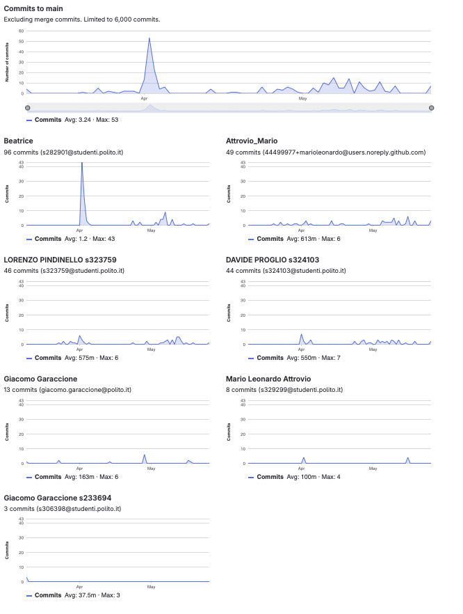

# Gruppo 8

## Valutazione deliverable V1

| gruppo | context diagram | business model | stakeholder | stories | interface | FR | NFR | use cases diagram | use cases | scenario | Glossary | DeploymentDiagram | functionality | estimation doc | precisione valori estimation | valutazione |
| --- | --- | --- | --- | --- | --- | --- | --- | --- | --- | --- | --- | --- | --- | --- | --- | --- |
| - | 1 | 0.5 | 0.5 | 1 | 1 | 3 | 3 | 1 | 5 | 5 | 5 | 2 | 1 | 2 | 2 | 33 |
| 8 | 90 | 100 | 100 | 90 | 95 | 95 | 100 | 100 | 100 | 95 | 100 | 100 | 100 | 85 | 94.7 | 98.33 |

## Valutazione deliverable V2

| gruppo | context diagram | business model | stakeholder | stories | interface | FR | NFR | ACCESS RIGHTS | use cases diagram | use cases | scenario | Glossary | DeploymentDiagram | functionality | estimation | precisione valori estimation | valutazione |
| --- | --- | --- | --- | --- | --- | --- | --- | --- | --- | --- | --- | --- | --- | --- | --- | --- | --- |
| - | 1 | 0.5 | 0.5 | 1 | 1 | 3 | 2 | 1 | 1 | 5 | 5 | 5 | 2 | 1 | 2 | 2 | 33 |
| 8 | 100 | 100 | 100 | 100 | 100 | 100 | 100 | 100 | 100 | 100 | 100 | 100 | 90 | 100 | 95 | 85 | 99.71 |

Le percentuali di v2 sono state riscalate in quanto la media pesata delle percentuali portava alcuni gruppi oltre al 100%.

## Valutazione codice e test (V2 + V3)

| Test Unit Totali | Test Unit Passati | Statement Coverage Unit | Branch Coverage Unit | Function Coverage Unit | Line Coverage Unit | Test Integration Totali | Test Integration Falliti | Statement Coverage Integration | Branch Coverage Integration | Function Coverage Integration | Line Coverage Integration | Correttezza V2 | Correttezza V3 | valutazione |
| --- | --- | --- | --- | --- | --- | --- | --- | --- | --- | --- | --- | --- | --- | --- |
| 1 | 0.5 | 2 | 2 | 1 | 1 | 1 | 0.5 | 2 | 2 | 1 | 1 | 16 | 2 | 33 |
| 50 | 100 | 100 | 75 | 100 | 100 | 50 | 100 | 75 | 50 | 75 | 75 | 83.1932773109244 | 100 | 81.25 |

 Unit e integration test prodotti dai gruppi sono stati eseguiti con la versione V2 del codice.

## Risultati Progetto

| Deliverable | Punteggio | Peso |
| --- | --- | --- |
| **Documenti V1** | 98.33% | 6 |
| **Documenti V2** | 98.37% | 2 |
| **Codice e Test** | 81.25% | 22 |
| **Timesheet** | 66.66% | 3 |
| **Valutazione** | 27.74 | 33 |
| **Valutazione** | 11.10 | 13.2 |

## Calcolo pesi progetto per singolo studente

| cognome | nome | email | gruppo | commit studente | commit totali | commit sul totale | coefficiente catme | coefficiente pesato | coefficiente progetto |
| --- | --- | --- | --- | --- | --- | --- | --- | --- | --- |
| ATTROVIO | MARIO LEONARDO | s329299@studenti.polito.it | 8 | 57 | 243 | 0.23 | 1.01 | 0.85 | 0.97 |
| PINDINELLO | LORENZO | s323759@studenti.polito.it | 8 | 46 | 243 | 0.19 | 1.01 | 0.85 | 0.96 |
| PROGLIO | DAVIDE | s324103@studenti.polito.it | 8 | 44 | 243 | 0.18 | 1.00 | 0.84 | 0.95 |
| VALENZANO | BEATRICE | s334221@studenti.polito.it | 8 | 96 | 243 | 0.40 | 1.00 | 0.88 | 1.00 |

 I pesi del progetto sono ottenuti per l'80% dal valore calcolato da CATME e per il 20% dalla percentuale dei commit del singolo studente sul totale dei commit effettuati dagli studenti dello stesso gruppo. Il risultato è stato poi riscalato in modo che il punteggio più alto del gruppo ottenesse 1.

## Studenti

| Nome | Matricola | Email | Bonus | Voto Primo Appello | Voto Secondo Appello | Voto terzo appello | Voto Progetto | Voto Finale |
| --- | --- | --- | --- | --- | --- | --- | --- | --- |
| MARIO LEONARDO ATTROVIO | 329299 | s329299@studenti.polito.it | 1 | 18.2 | | | 10.80 | 30 |
| LORENZO PINDINELLO | 323759 | s323759@studenti.polito.it | 1 | 18.3 | | | 10.68 | 30 |
| DAVIDE PROGLIO | 324103 | s324103@studenti.polito.it | 1 |  | 13.2 | 16.2 | 10.56 | 28  |
| BEATRICE VALENZANO | 334221 | s334221@studenti.polito.it | 1 |  | 11.4 | | 11.10 | 24 |
